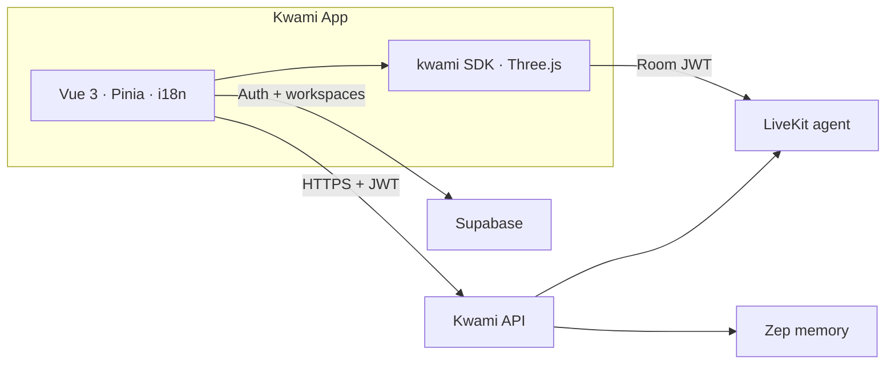

# kwami-app

[](https://github.com/kwami-labs/kwami-app/actions/workflows/ci.yml)
[](https://github.com/kwami-labs/kwami-app/actions/workflows/cd.yml)
[](https://github.com/kwami-labs/kwami-app/releases/latest)
[](.nvmrc)
[](https://bun.sh)
[](https://vuejs.org/)
[](https://www.typescriptlang.org/)
[](LICENSE)
[](./SECURITY.md)

Web, PWA, and optional desktop client for **Kwami** — 3D AI companions with real-time voice, long-term memory, and a workspace of apps (mail, phone, calendar, wallet).

This repository is the **frontend**. The voice agent, token issuer, memory service, and model catalogues live on the Kwami API and LiveKit.

| | |
|---|---|
| Version | [Latest release](https://github.com/kwami-labs/kwami-app/releases/latest) — semantic-release on `main` / `stg` |
| Runtime | Vue 3, TypeScript 5.9, Vite 7, bun 1.2 |
| Host | Cloudflare Workers (`kwami-app`, `kwami-app-stg`, `kwami-app-dev`) |
| Auth | [Supabase](https://supabase.com/) — email, phone OTP, Google, Phantom, MetaMask |
| License | [Apache License 2.0](./LICENSE) |
| Security | [SECURITY.md](./SECURITY.md) |
| Contributing | [CONTRIBUTING.md](./CONTRIBUTING.md) |

## Documentation

| Document | Contents |
|---|---|
| [docs/](./docs/README.md) | Architecture, guides, concepts, and reference. |
| [Architecture](./docs/architecture/overview.md) | System design, data flow, backend integration. |
| [Deployment](./docs/architecture/deployment.md) | CI, semantic-release, and the three Cloudflare Workers. |
| [Environment](./docs/guides/environment.md) | `VITE_*` variables and what must never ship in the bundle. |
| [LICENSE](./LICENSE) | Apache 2.0 terms. |
| [SECURITY.md](./SECURITY.md) | Vulnerability reporting and secret handling. |
| [CONTRIBUTING.md](./CONTRIBUTING.md) | Branch model, Conventional Commits, test lanes, and releases. |
| [Changelog](./CHANGELOG.md) | Generated from Conventional Commits by semantic-release. |

## Contents

- [Features](#features)
- [Architecture](#architecture)
- [Run locally](#run-locally)
- [Layout](#layout)
- [Testing](#testing)
- [Deployment](#deployment)

---

## Features

- **Voice pipeline** — STT → LLM → TTS or a realtime speech-to-speech model, streamed over [LiveKit](https://livekit.io)
- **3D avatars** — Blob, black hole, particles-face, and eye-iris renderers on [Three.js](https://threejs.org/) via the [Kwami SDK](https://github.com/kwami-labs/kwami)
- **Soul** — Per-companion personality, traits, and system prompt, synced to the live agent
- **Memory** — Per-companion knowledge graph ([Zep](https://www.getzep.com/) behind the API), 2D/3D explorer
- **Workspaces** — Multiple named companions with isolated config, memory, and channels
- **Tools** — Client tools the agent can invoke (open panels, change theme, draft mail) plus MCP
- **Scene & theme** — HDRI / video / image backgrounds, glass UI, light / dark / auto
- **Apps** — Contacts, email, calendar, phone, WhatsApp, SMS, wallet
- **Energy** — Metered credits, packs, usage logs
- **Auth** — Email, phone OTP, Google, Phantom SIWS, MetaMask (EIP-6963)
- **PWA** — `vite-plugin-pwa` with Workbox precache
- **Desktop** — Optional [Tauri 2](https://v2.tauri.app/) shell
- **i18n** — English, Spanish, French, Italian, Portuguese

---

## Architecture



| Layer | Responsibility |
|---|---|
| Vue UI | Auth gate, sidebar panels, canvas host |
| `kwami` SDK | WebGL avatar, LiveKit room, soul, client tools |
| Kwami API | Tokens, catalogues, memory CRUD, credits, channels, apps |
| Supabase | Auth and `user_kwamis` / `user_app_settings` |
| Zep | Long-term graph (never called from the browser) |
| Cloudflare Worker | Assets-only host for `dist/` — no request billing |

Deep dive: [Architecture overview](docs/architecture/overview.md) · [Data flow](docs/architecture/data-flow.md) · [Backend integration](docs/architecture/backend-integration.md)

### Tech stack

| Area | Choice |
|---|---|
| UI | Vue 3 (Composition API, `<script setup>`), TypeScript 5.9 |
| Build | Vite 7, bun |
| State | Pinia |
| 3D / voice runtime | `kwami` 2.2.0-dev.1, Three.js 0.186 |
| Auth | `@supabase/supabase-js` |
| i18n | `vue-i18n` |
| PWA | `vite-plugin-pwa` |
| Desktop | Tauri 2 |
| Tests | Vitest + MSW, Playwright |
| Lint / format | ESLint 9, Prettier |
| Host | Cloudflare Workers (`infra/wrangler.jsonc`) |
| Release | semantic-release on `main` / `stg` |

---

## Run locally

```bash
git clone git@github.com:kwami-labs/kwami-app.git
cd kwami-app
bun install
cp .env.sample .env
# Edit .env — see docs/guides/environment.md
bun run dev
```

Open [http://localhost:5173](http://localhost:5173). The avatar renders without a backend; voice, memory, and apps need the API.

| Variable | Purpose |
|---|---|
| `VITE_API_URL` | Kwami API base URL (`POST /token` lives here) |
| `VITE_LIVEKIT_URL` | LiveKit WebSocket URL |
| `VITE_SUPABASE_URL` | Supabase project URL |
| `VITE_SUPABASE_PUBLISHABLE_KEY` | Supabase anon / publishable key |
| `VITE_AUTH_PROVIDERS` | Optional. Comma-separated OAuth / wallet buttons (default `google`). Email + password is always on |

These are public (`VITE_*` is inlined into the bundle). Provider secrets stay on the API. Reference: [Environment variables](docs/reference/environment-variables.md)

To develop against a local Kwami SDK checkout:

```bash
cd ../kwami && bun link
cd ../kwami-app && bun link kwami
```

### Scripts

| Command | Description |
|---|---|
| `bun run dev` | Dev server (port 5173, strict) |
| `bun run build` | Type-check + production build |
| `bun run preview` | Preview the production build |
| `bun run typecheck` | `vue-tsc` only |
| `bun run lint` / `lint:check` | ESLint with / without `--fix` |
| `bun run format` / `format:check` | Prettier on `src/` |
| `bun run test:unit` | Vitest once |
| `bun run test:e2e` | Playwright (Chromium) |
| `bun run test:ci-scripts` | Promotion-path unit tests |
| `bun run tauri dev` | Desktop shell |
| `bun run cf:preview` | Preview `dist/` on a local Worker |
| `bun run cf:deploy` / `cf:deploy:dry` | Publish (or dry-run) production Worker |
| `bun run cf:deploy:stg` / `cf:deploy:dev` | Publish channel Workers |

---

## Layout

```
src/
├── components/     # Auth, sidebar, settings/apps panels, memory, UI
├── composables/    # Kwami lifecycle, catalogues, avatar sync, agent tools
├── i18n/           # en / es / fr / it / pt
├── lib/            # apiClient, supabase, catalog cache
├── presets/        # Avatar, scene, theme, soul
├── stores/         # Pinia
├── utils/          # Beat clock, blob tween, viewport fit
├── App.vue         # Canvas + lazy panels
└── main.ts
docs/               # Architecture, guides, concepts, reference
e2e/                # Playwright
tests/              # Vitest + MSW
infra/              # Wrangler Worker + Terraform custom domain
scripts/ci/         # Promotion path and push-guard
src-tauri/          # Tauri 2
```

Maps: [Stores](docs/reference/stores.md) · [Composables](docs/reference/composables.md) · [Panels](docs/reference/panels.md) · [API](docs/reference/api.md)

---

## Testing

```bash
bun run typecheck && bun run lint:check && bun run format:check && bun run test:unit
bun run test:e2e
bun run test:ci-scripts
```

That is the local stand-in for CI. Reach for a single lane while iterating.

| Lane | Command | What it covers |
|---|---|---|
| Lint | `bun run typecheck && bun run lint:check && bun run format:check` | Types, ESLint, Prettier |
| Unit | `bun run test:unit` | Hermetic Vitest + MSW. Coverage floors in `vitest.config.ts` |
| E2E | `bun run test:e2e` | Playwright against the real app, with Supabase / API / LiveKit stubbed at the wire |
| CI scripts | `bun run test:ci-scripts` | Promotion path and push-guard |

`bun run test:unit --coverage` is what CI runs. Floors are ratcheted upward — never edit one downward to make a red build green.

---

## Deployment

Cloudflare Workers, assets-only, no migrations. Channel Workers match the promotion path:

| Branch | Worker | GitHub Environment |
|---|---|---|
| `main` | `kwami-app` | `production` |
| `stg` | `kwami-app-stg` | `stg` |
| `dev` | `kwami-app-dev` | `dev` |

`VITE_*` is baked at build time, so each channel must be built with its own values.

```
push main ──► ci ──► cd ─┬─ release   semantic-release: version, tag, CHANGELOG, GitHub Release
                         └─ deploy    wrangler --env production  →  kwami-app

push stg  ──► ci ──► cd ─┬─ release   semantic-release: vX.Y.Z-stg.N (prerelease)
                         └─ deploy    wrangler --env stg          →  kwami-app-stg

push dev  ──► ci ──► cd ─── deploy    wrangler --env dev          →  kwami-app-dev
                          (fast lane: lint + unit only)
```

`cd` is called by `ci`, not triggered by the push, so nothing is released or deployed from a commit whose tests never passed.

It is a `workflow_call`, deliberately not a `workflow_run`: that trigger always executes the copy of the workflow on the **default** branch. Called this way, the `cd.yml` that runs is the one from the commit that just passed. `workflow_dispatch` retries a delivery by hand after a transient registry or Cloudflare failure.

> **`dev` runs the fast lane only.** A push to `dev` skips e2e, vuln and the production build, so what reaches the development Worker has had `lint` and `unit` run over it and nothing else. Every pull request into it still runs the whole suite.

### Wiring Cloudflare up

The deploy **skips with a warning** while `CLOUDFLARE_API_TOKEN` is unset, so the pipeline is green before the account is connected. Once the token is set, a missing `CLOUDFLARE_ACCOUNT_ID` is a hard failure — a green deploy that shipped nothing is worse than a red one.

Create GitHub Environments named `production`, `stg` and `dev` (Settings → Environments) holding:

| kind | name | value |
|---|---|---|
| secret | `CLOUDFLARE_API_TOKEN` | a token with Workers edit on this account |
| secret | `CLOUDFLARE_ACCOUNT_ID` | the account that owns `kwami.io` |
| secret | `VITE_SUPABASE_PUBLISHABLE_KEY` | Supabase anon / publishable key |
| variable | `VITE_API_URL` | Kwami API origin for that channel |
| variable | `VITE_LIVEKIT_URL` | LiveKit WebSocket URL |
| variable | `VITE_SUPABASE_URL` | Supabase project URL |
| variable | `VITE_AUTH_PROVIDERS` | Comma-separated provider list |

After the production Worker exists, Terraform in [`infra/terraform`](infra/terraform) attaches `app.kwami.io` — the apex stays on `kwami-waitlist`.

Versions, tags, the GitHub Release and [`CHANGELOG.md`](./CHANGELOG.md) are cut automatically by semantic-release after `ci` goes green on `main` or `stg` — see [Releases](./CONTRIBUTING.md#releases).

---

## References

| Project | Role |
|---|---|
| [kwami-app](https://github.com/kwami-labs/kwami-app) | This client |
| [kwami](https://github.com/kwami-labs/kwami) | 3D companion SDK |
| Kwami API | Sibling backend (`VITE_API_URL`) — tokens, memory, credits, catalogues |

[Vue 3](https://vuejs.org/) · [Vite](https://vite.dev/) · [Pinia](https://pinia.vuejs.org/) · [Three.js](https://threejs.org/) · [LiveKit](https://docs.livekit.io/) · [Supabase Auth](https://supabase.com/docs/guides/auth) · [Cloudflare Workers](https://developers.cloudflare.com/workers/) · [Tauri 2](https://v2.tauri.app/)

---

[Apache License 2.0](LICENSE)

Report vulnerabilities privately — do not open a public issue. See [SECURITY.md](./SECURITY.md).
