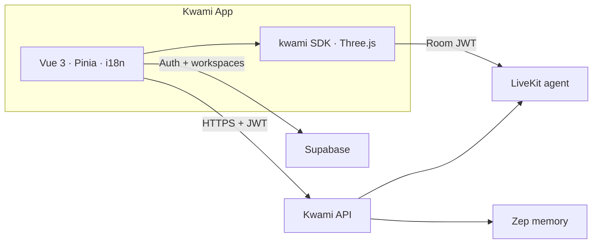

# Kwami App

[](https://github.com/kwami-labs/kwami-app/actions/workflows/ci.yml)
[](LICENSE)
[](.nvmrc)
[](https://bun.sh)
[](https://vuejs.org/)
[](https://www.typescriptlang.org/)

Web, PWA, and optional desktop client for **Kwami** — 3D AI companions with real-time voice, long-term memory, and a workspace of apps (mail, phone, calendar, wallet).

This repository is the **frontend**. The voice agent, token issuer, memory service, and model catalogues live on the Kwami API and LiveKit.

**Documentation:** [docs/](docs/README.md) · [Changelog](CHANGELOG.md) · [Security](SECURITY.md) · [FAQ](docs/faq.md)

---

## Features

- **Voice pipeline** — STT → LLM → TTS or a realtime speech-to-speech model, streamed over [LiveKit](https://livekit.io)
- **3D avatars** — Blob, black hole, particles-face, and eye-iris renderers on [Three.js](https://threejs.org/) via the [Kwami SDK](https://github.com/kwami-labs/kwami)
- **Soul** — Per-companion personality, traits, and system prompt, synced to the live agent
- **Memory** — Per-companion knowledge graph ([Zep](https://www.getzep.com/) behind the API), 2D/3D explorer
- **Workspaces** — Multiple named companions with isolated config, memory, and channels
- **Tools** — Client tools the agent can invoke (open panels, change theme, draft mail, …) plus MCP
- **Scene & theme** — HDRI / video / image backgrounds, glass UI, light/dark/auto
- **Apps** — Contacts, email, calendar, phone, WhatsApp, SMS, wallet
- **Energy** — Metered credits, packs, usage logs
- **Auth** — [Supabase](https://supabase.com/) (Google by default; optional Apple, Microsoft, GitHub, wallets)
- **PWA** — `vite-plugin-pwa` with Workbox precache
- **Desktop** — Optional [Tauri 2](https://v2.tauri.app/) shell
- **i18n** — English and Spanish

---

## Architecture



| Layer | Responsibility |
| --- | --- |
| Vue UI | Auth gate, sidebar panels, canvas host |
| `kwami` SDK | WebGL avatar, LiveKit room, soul, client tools |
| Kwami API | Tokens, catalogues, memory CRUD, credits, channels, apps |
| Supabase | Auth and `user_kwamis` / `user_app_settings` |
| Zep | Long-term graph (never called from the browser) |

Deep dive: [Architecture overview](docs/architecture/overview.md) · [Data flow](docs/architecture/data-flow.md) · [Backend integration](docs/architecture/backend-integration.md)

---

## Tech stack

| Area | Choice |
| --- | --- |
| UI | Vue 3 (Composition API, `<script setup>`), TypeScript 5.9 |
| Build | Vite 7, bun |
| State | Pinia |
| 3D / voice runtime | `kwami` 2.2.0-dev.1, Three.js 0.186 |
| Auth | `@supabase/supabase-js` |
| i18n | `vue-i18n` |
| PWA | `vite-plugin-pwa` |
| Desktop | Tauri 2 |
| Tests | Vitest + MSW, Playwright |
| Lint / format | ESLint 9, Prettier |

---

## Prerequisites

- **Node.js** 22 ([`.nvmrc`](.nvmrc))
- **[bun](https://bun.sh)** 1.2+
- A running **Kwami API**, **LiveKit** project, and **Supabase** project (Auth + `user_kwamis`, `user_app_settings`)

To develop against a local Kwami SDK checkout:

```bash
cd ../kwami && bun link
cd ../kwami-app && bun link kwami
```

---

## Quick start

```bash
git clone git@github.com:kwami-labs/kwami-app.git
cd kwami-app
bun install
cp .env.sample .env
# Edit .env — see docs/guides/environment.md
bun run dev
```

Open [http://localhost:5173](http://localhost:5173). The avatar renders without a backend; voice, memory, and apps need the API.

Full walkthrough: [Getting started](docs/guides/getting-started.md)

### Environment

| Variable | Purpose |
| --- | --- |
| `VITE_API_URL` | Kwami API base URL (`POST /token` lives here) |
| `VITE_LIVEKIT_URL` | LiveKit WebSocket URL |
| `VITE_SUPABASE_URL` | Supabase project URL |
| `VITE_SUPABASE_PUBLISHABLE_KEY` | Supabase anon / publishable key |
| `VITE_AUTH_PROVIDERS` | Optional. Comma-separated OAuth / wallet buttons (default `google`). Email + password is always on and is not listed here |

These are public (`VITE_*` is inlined into the bundle). Provider secrets stay on the API. Reference: [Environment variables](docs/reference/environment-variables.md)

---

## Scripts

| Command | Description |
| --- | --- |
| `bun run dev` | Dev server (port 5173, strict) |
| `bun run build` | Type-check + production build |
| `bun run preview` | Preview the production build |
| `bun run typecheck` | `vue-tsc` only |
| `bun run lint` / `lint:check` | ESLint with / without `--fix` |
| `bun run format` / `format:check` | Prettier on `src/` |
| `bun run test:unit` | Vitest once |
| `bun run test:e2e` | Playwright (Chromium, `--mode test`) |
| `bun run tauri dev` | Desktop shell |
| `bun run cf:preview` | Preview `dist/` on a local Worker |
| `bun run cf:deploy` / `cf:deploy:dry` | Publish (or dry-run) production Worker |
| `bun run cf:deploy:stg` / `cf:deploy:dev` | Publish channel Workers |

Testing details: [docs/guides/testing.md](docs/guides/testing.md)

---

## Project structure

```
src/
├── components/     # Auth, sidebar, settings/apps panels, memory, UI
├── composables/    # Kwami lifecycle, catalogues, avatar sync
├── i18n/           # en / es
├── lib/            # apiClient, supabase, catalog cache
├── presets/        # Avatar, scene, theme, soul
├── stores/         # Pinia
├── App.vue         # Canvas + lazy panels
└── main.ts
docs/               # Architecture, guides, concepts, reference
e2e/                # Playwright
tests/              # Vitest + MSW
infra/              # Cloudflare Workers
src-tauri/          # Tauri 2
```

Maps: [Stores](docs/reference/stores.md) · [Composables](docs/reference/composables.md) · [Panels](docs/reference/panels.md) · [API](docs/reference/api.md) · [Events](docs/reference/events.md)

---

## Documentation

| Section | Contents |
| --- | --- |
| [Guides](docs/guides/getting-started.md) | Install, env, development, desktop, testing, i18n, troubleshooting, releasing |
| [Architecture](docs/architecture/overview.md) | System design, deployment, mermaid flows |
| [Security](docs/security.md) | Trust boundaries and what must never ship in `VITE_*` |
| [ADRs](docs/adr/README.md) | Accepted architecture decisions |
| [Concepts](docs/concepts/kwami-runtime.md) | Runtime, workspaces, voice, memory, avatars, soul, credits, comms, tools |
| [Reference](docs/reference/stores.md) | Stores, composables, components, API, events, shortcuts |
| [FAQ](docs/faq.md) | Short answers |
| [Changelog](CHANGELOG.md) | Keep a Changelog |

---

## Contributing

Please read [CONTRIBUTING.md](CONTRIBUTING.md) and the [Code of Conduct](CODE_OF_CONDUCT.md).

```bash
bun run typecheck && bun run lint:check && bun run format:check && bun run test:unit
```

Commits follow [Conventional Commits](https://www.conventionalcommits.org/). Security issues: [SECURITY.md](SECURITY.md).

---

## References

### First-party

| Project | Role |
| --- | --- |
| [kwami-app](https://github.com/kwami-labs/kwami-app) | This client |
| [kwami](https://github.com/kwami-labs/kwami) | 3D companion SDK |
| Kwami API | Sibling backend (`VITE_API_URL`) — tokens, memory, credits, catalogues. Contract: [docs/reference/api.md](docs/reference/api.md) |

### Runtime and services

- [Vue 3](https://vuejs.org/) · [Vite](https://vite.dev/) · [Pinia](https://pinia.vuejs.org/) · [vue-i18n](https://vue-i18n.intlify.dev/)
- [Three.js](https://threejs.org/)
- [LiveKit](https://docs.livekit.io/) — realtime rooms and agents
- [Supabase Auth](https://supabase.com/docs/guides/auth) · [supabase-js](https://supabase.com/docs/reference/javascript/introduction)
- [Zep](https://help.getzep.com/docs) — temporal knowledge graphs
- [Tauri 2](https://v2.tauri.app/)
- [Workbox / vite-plugin-pwa](https://vite-pwa-org.netlify.app/)
- [Vitest](https://vitest.dev/) · [Playwright](https://playwright.dev/) · [MSW](https://mswjs.io/)
- [Iconify](https://iconify.design/)

### Voice / models (configured via the API catalogues)

- [OpenAI](https://platform.openai.com/docs) (LLM, TTS, Realtime)
- [Deepgram](https://developers.deepgram.com/) (STT)

---

## License

[Apache License 2.0](LICENSE)
