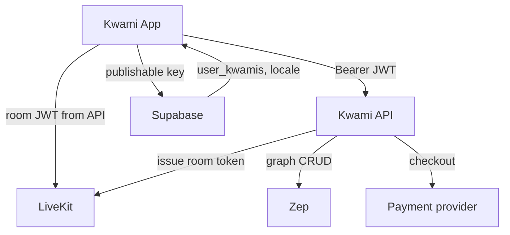

# Backend integration

The client depends on three remote systems: the **Kwami API**, **LiveKit**, and **Supabase**.

## Kwami API

Base URL: `VITE_API_URL` (trailing slashes stripped). Default `http://localhost:8080`.

All calls go through [`src/lib/apiClient.ts`](../../src/lib/apiClient.ts).

| Behavior | Default |
| --- | --- |
| Timeout | 15s (`timeoutMs: 0` disables) |
| Retries | 2 extra attempts for GET/PUT, or any method with `Idempotency-Key` |
| Retriable statuses | 408, 425, 429, 502, 503, 504 |
| 500 | Not retried (FastAPI handler errors are deterministic) |
| Auth | `Authorization: Bearer <supabase access_token>` unless `auth: false` |
| 401 | One replay after clearing the token cache |
| 402 | `ApiError.isInsufficientCredits` |
| Abort | Manual `AbortSignal` compose (Tauri / WebKitGTK) |

Token cache:

- Reads `supabase.auth.getSession()` once, with in-flight de-duplication
- Treats `expires_at` as unix seconds
- Refreshes 60s before expiry
- Invalidates on `onAuthStateChange`

`createRequestGuard()` aborts the previous request for a key and exposes `isCurrent()` so a resolved body that lost the race is dropped. Memory, email, contacts, calendar, and wallet use it.

Catalogues (models, voices, languages) use [`src/lib/catalogResource.ts`](../../src/lib/catalogResource.ts): in-flight de-duplication, ref-counted loading, failures resolve to `null` so panels can fall back to bundled lists.

Route inventory: [API reference](../reference/api.md).

## LiveKit

| Variable | Role |
| --- | --- |
| `VITE_LIVEKIT_URL` | WebSocket URL (`wss://…`) |

`useKwami` does **not** pass a `tokenEndpoint` into the SDK. `connect()` calls `api.post('/token', { participantName, kwamiId? })` so a `402` is a typed `ApiError`. See [ADR 0005](../adr/0005-token-minting-via-api-client.md).

`KwamiConfig.agent.livekit` still receives:

- `url` — `VITE_LIVEKIT_URL`
- `userId` — the per-kwami `memoryUserId`
- `voice` — current pipeline config from the voice store
- `onSearchResults` — web-search hits shown as orbit cards

The client treats a 402 from `/token` as out-of-energy.

Web search runs **on the agent**. Results arrive on the LiveKit data channel and become `kwami:search_results` / the `useSearchResults` store.

## Supabase

| Variable | Role |
| --- | --- |
| `VITE_SUPABASE_URL` | Project URL |
| `VITE_SUPABASE_PUBLISHABLE_KEY` | Anon / publishable key |

Client: [`src/lib/supabase.ts`](../../src/lib/supabase.ts). Missing credentials log a warning; auth simply does not work.

Tables the app uses directly:

| Table | Purpose |
| --- | --- |
| `user_kwamis` | Companion rows: `id`, `user_id`, `name`, `emoji`, `colors`, `config` |
| `user_app_settings` | Per-user locale (`locale`, upsert on `user_id`) |

Auth is Google (popup / ID token) via `@supabase/supabase-js`. Email magic-link can be enabled in the project; the UI ships a Google button as the primary path.

Row Level Security must restrict `user_kwamis` and `user_app_settings` to `auth.uid()`. This repo does not ship migrations; they live with the backend / Supabase project.

## What never leaves the backend

- Provider keys (OpenAI, Deepgram, ElevenLabs, …)
- Zep API keys
- Stripe secret keys
- LiveKit API keys (the client only holds a short-lived room JWT)

Any `VITE_*` value is public. Do not prefix secrets with `VITE_`.
