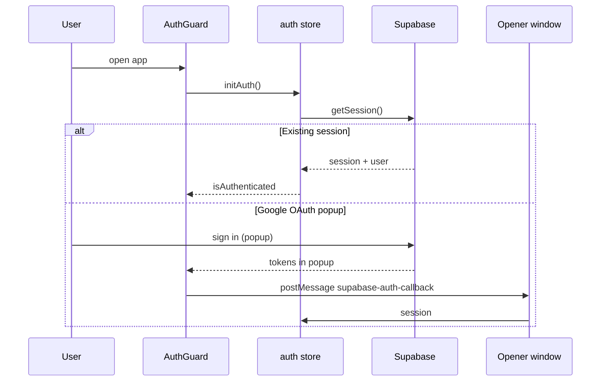
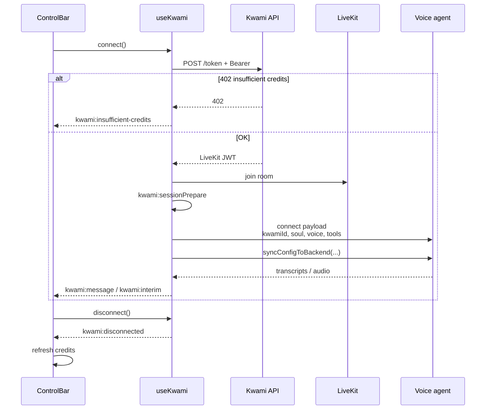
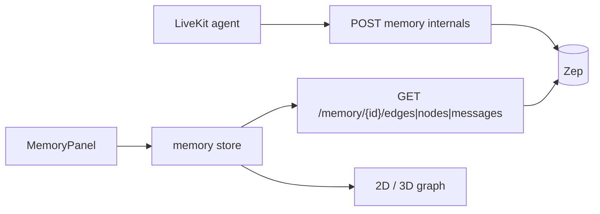

# Data flow

This page walks the four flows that define the product: authentication, companion workspaces, a live voice session, and long-term memory.

## Authentication



- `AuthGuard` shows welcome rings for at least 3.5s while the session restores.
- OAuth can complete in a popup. The popup posts `{ type: 'supabase-auth-callback', session }` to `window.opener` and closes. The parent only accepts messages from the same origin.
- Hash fragments containing `access_token` are stripped with `history.replaceState`.
- Signing out calls `supabase.auth.signOut()` and clears store user/session.

On `isAuthenticated`, `App.vue` starts credits polling and `workspaceStore.loadFromDb(userId)`, and loads locale from `user_app_settings`.

## Workspaces (companions)

A **workspace** is one named Kwami: id, name, colors, and a JSON config snapshot.

```mermaid
flowchart TB
  Auth[Signed-in user] --> Load[loadFromDb]
  Load --> Table[(user_kwamis)]
  Table --> List[workspaces[]]
  List --> Active[activeWorkspaceId]
  Active --> Apply[applyConfig]
  Apply --> Stores[avatar / voice / scene / theme / telephony]
  Stores --> Draft[updateActiveConfigLocal]
  Draft --> Dirty[hasUnsavedConfig]
  Dirty --> Save[saveActiveConfig]
  Save --> Table
```

- Empty accounts get one randomly named companion on first load.
- Switching companions writes the current draft onto the previous row (local only), then applies the next row's snapshot.
- Deleting a companion also best-effort deletes `/memory/kwami_{userId}_{kwamiId}`.

See [Workspaces](../concepts/workspaces.md).

## Voice session



`memoryUserId` is `kwami_{authUserId}_{activeKwamiId}`. The agent and Zep treat that string as the memory user, so two companions never share a graph.

After the room is up, `syncAllConfigToBackend` pushes soul, VAD/enhancements, LLM params, TTS/realtime voice, STT model, client tool definitions, and memory retrieval settings. Panels do not have to be mounted for the agent to receive them.

See [Voice pipeline](../concepts/voice-pipeline.md).

## Memory graph



The panel never talks to Zep. The store pages edges and nodes (100 per request) with `createRequestGuard()` so a mid-load companion switch cannot append the old graph onto the new one.

See [Memory](../concepts/memory.md).

## Credits

Usage is billed on the backend when a voice session ends. The client:

1. Loads `/credits/balance` on sign-in
2. Reloads balance and usage logs on `kwami:disconnected`
3. Surfaces `kwami:insufficient-credits` as a toast if `POST /token` returns 402

See [Credits](../concepts/credits.md).

## Agent → UI actions

`useWorkspaceAgentTools` registers client tools on the Kwami instance (open a panel, change theme, compose email, and so on). The LiveKit agent invokes them over the data channel. Tools are re-synced on every `connect()` because they are registered before the room opens.

See [Tools](../concepts/tools.md).
