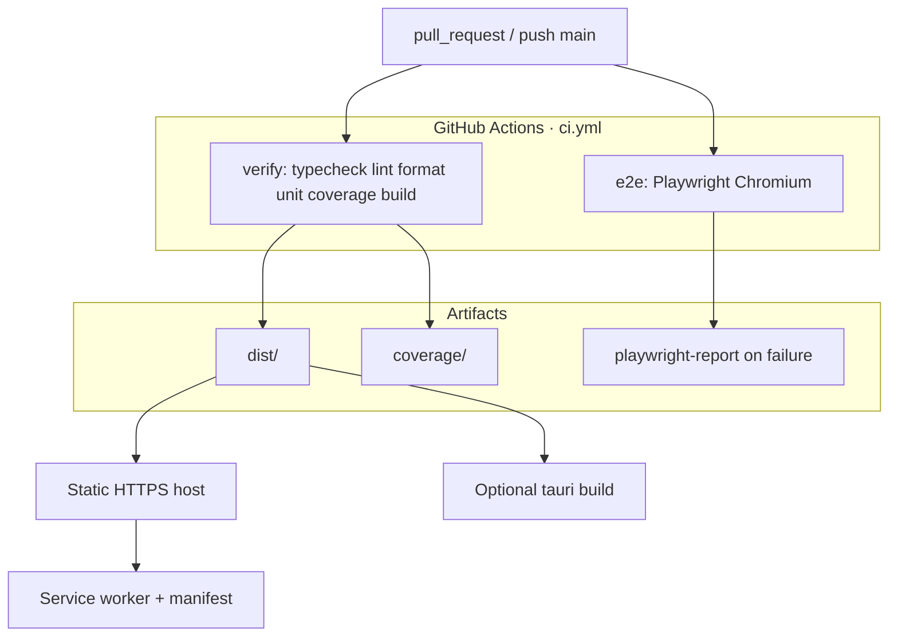

# Deployment

How a commit becomes a running client. This repo ships a **static Vite app** plus an optional Tauri shell. It is not a Node server.

## CI

[`.github/workflows/ci.yml`](../../.github/workflows/ci.yml):

| Job | What |
| --- | --- |
| `verify` | `bun install --frozen-lockfile`, typecheck, lint, format, `test:unit --coverage`, `build` |
| `e2e` | Playwright + Chromium deps, `bun run test:e2e` |

Concurrency cancels in-flight runs on the same ref. bun version is pinned to **1.2.21**.

CI does not need production secrets. Unit and e2e use injected / `.env.test` values.

## Web / PWA

1. Build with production `VITE_API_URL`, `VITE_LIVEKIT_URL`, `VITE_SUPABASE_*`, and `VITE_AUTH_PROVIDERS`
2. Serve `dist/` over **HTTPS** (required for service worker, mic, install)
3. Set CSP / COOP on the host if you can; the app itself does not emit headers

`vite-plugin-pwa`:

- `registerType: 'autoUpdate'`
- Precache: js / css / html / ico / png / svg / woff2 / mp3
- Runtime cache: Google Fonts only (`CacheFirst`)
- Manifest id `/`, `display: standalone`, dark theme `#050608`

Do not put the API origin behind a service-worker cache.

## Desktop

`bun run tauri build` runs `bun run build` then packages `../dist`. Same baked env. [Desktop](../guides/desktop.md).

## CORS and redirects

The browser origin (e.g. `https://app.example`) must be allowed by:

- Kwami API CORS
- Supabase Auth redirect URLs
- LiveKit project (if it restricts origins)

Locally that origin is `http://localhost:5173` (`strictPort: true`).

## What not to deploy

- `.env` files
- `coverage/`, `playwright-report/`, `test-results/`
- Source maps to a public bucket if they include anything sensitive (they should not, if ADR 0002 is kept)

## Related

- [Releasing](../guides/releasing.md)
- [Testing](../guides/testing.md)
- [Environment](../guides/environment.md)
