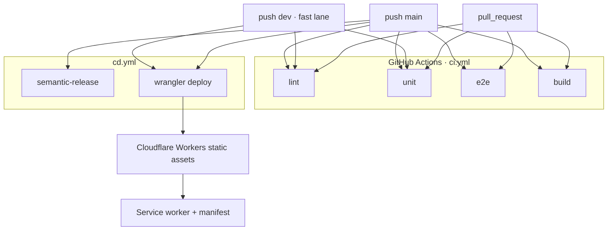

# Deployment

How a commit becomes a running client. This repo ships a **static Vite app** plus an optional Tauri shell. It is not a Node server.



## CI

[`.github/workflows/ci.yml`](../../.github/workflows/ci.yml):

| Job | What |
| --- | --- |
| `verify` | `bun install --frozen-lockfile`, typecheck, lint, format, `test:unit --coverage`, `build` |
| `e2e` | Playwright + Chromium deps, `bun run test:e2e` |

Concurrency cancels in-flight runs on the same ref. bun version is pinned to **1.2.21**.

CI does not need production secrets. Unit and e2e use injected / `.env.test` values.

## Web / PWA

The host is an **assets-only Cloudflare Worker** ([`infra/wrangler.jsonc`](../../infra/wrangler.jsonc)). There is no `main` script, so requests are served from the CDN and are not billed as Worker invocations. Unmatched paths fall back to `/index.html` (`not_found_handling: single-page-application`).

1. Build with production `VITE_API_URL`, `VITE_LIVEKIT_URL`, `VITE_SUPABASE_*`, and `VITE_AUTH_PROVIDERS`
2. Serve `dist/` over **HTTPS** (required for service worker, mic, install)
3. Host headers live in [`public/_headers`](../../public/_headers) (copied into `dist/`): COOP is `same-origin-allow-popups` so OAuth popups can still `postMessage` the opener. CSP is not set yet — WebGL, LiveKit, and Supabase need a measured allowlist.

### Local deploy

```bash
bun run build
bun run cf:preview          # wrangler dev against dist/
bun run cf:deploy:dry       # validate upload, do not publish
bun run cf:deploy           # production Worker `kwami-app` → kwami.io
bun run cf:deploy:dev       # dev Worker `kwami-app-dev` → dev.kwami.io
```

| Branch | App | API | Worker |
| --- | --- | --- | --- |
| `main` | `https://kwami.io` | `https://api.kwami.io` | `kwami-app` |
| `dev` | `https://dev.kwami.io` | `https://api.dev.kwami.io` | `kwami-app-dev` |

`VITE_*` is baked at build time. `VITE_API_URL` is fixed per channel in `cd.yml`. The app host and the API host are different: this Worker only serves static assets.

`cf:deploy:dry` and `wrangler deploy --dry-run` **do not publish**. A real deploy needs the Cloudflare account that owns `kwami.io`. After the Worker exists, Terraform in [`infra/terraform`](../../infra/terraform) attaches `kwami.io` or `dev.kwami.io`.

### GitHub Actions

[`.github/workflows/ci.yml`](../../.github/workflows/ci.yml) is the test gate. On a green push to `main` or `dev` it calls [`.github/workflows/cd.yml`](../../.github/workflows/cd.yml): `main` cuts the version, tag, changelog and GitHub Release; both deploy their channel Worker. The matching GitHub Environment (`production`, `dev`) supplies:

| Kind | Names |
| --- | --- |
| Secrets | `CLOUDFLARE_API_TOKEN`, `CLOUDFLARE_ACCOUNT_ID`, `VITE_SUPABASE_PUBLISHABLE_KEY` |
| Variables | `VITE_LIVEKIT_URL`, `VITE_SUPABASE_URL`, `VITE_AUTH_PROVIDERS` |

Alternatively, connect the repo in Cloudflare Workers Builds with **Build command** `bun run build`, **Deploy command** `npx wrangler deploy --config infra/wrangler.jsonc`, and the same `VITE_*` env.

`vite-plugin-pwa`:

- `registerType: 'autoUpdate'`
- Precache: js / css / html / ico / png / svg / woff2 / mp3
- Runtime cache: Google Fonts only (`CacheFirst`)
- Manifest id `/`, `display: standalone`, dark theme `#050608`

Do not put the API origin behind a service-worker cache.

## Desktop

`bun run tauri build` runs `bun run build` then packages `../dist`. Same baked env. [Desktop](../guides/desktop.md).

## CORS and redirects

The browser origin (e.g. `https://app.example`) must be allowed by:

- Kwami API CORS
- Supabase Auth redirect URLs
- LiveKit project (if it restricts origins)

Locally that origin is `http://localhost:5173` (`strictPort: true`). Wrangler preview is `http://localhost:8787`.

## What not to deploy

- `.env` files
- `coverage/`, `playwright-report/`, `test-results/`
- Source maps to a public bucket if they include anything sensitive (they should not, if ADR 0002 is kept)

## Related

- [Releasing](../guides/releasing.md)
- [Testing](../guides/testing.md)
- [Environment](../guides/environment.md)
