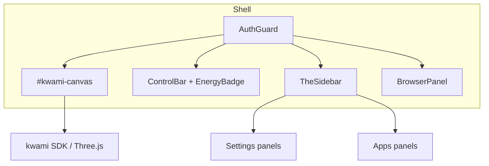
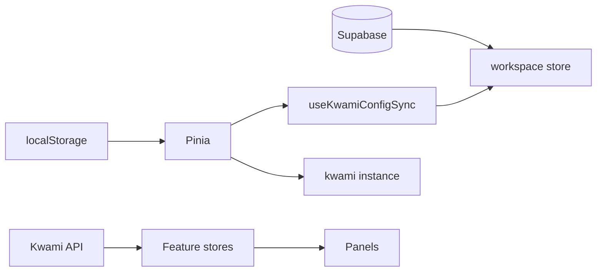

# Frontend architecture

The UI is a Vue 3 Composition API app (`<script setup>`) with Pinia, `vue-i18n`, and vue-toastification. There is **no Vue Router**. The canvas is always the main surface; settings and apps are sidebar panels selected by the UI store.

## Bootstrap

[`src/main.ts`](../../src/main.ts) creates the Vue app, installs Pinia / toast / i18n, then loads persisted settings:

| Store | What is loaded |
| --- | --- |
| `theme` | Mode, accent, glass, sidebar position, accessibility |
| `scene` | Background, overlays, HDRI, effects |
| `avatar` | Renderer type and per-renderer parameters |
| `voice` | Pipeline, models, soul, enhancements, memory UI |

Those four stores read `localStorage` so a refresh does not flash defaults. Companion **workspaces** are not local-only: they load from Supabase after sign-in.

## Layout

[`src/App.vue`](../../src/App.vue) is the only page.

| Region | Role |
| --- | --- |
| `AuthGuard` | Welcome rings while session restores; `AuthPage` if signed out; default slot when signed in |
| `#kwami-canvas` | Host for the Kwami / Three.js renderer |
| `ControlBar` | Connect / disconnect, record, listening state |
| `EnergyBadge` | Credit balance |
| `SidebarModeSwitch` | Toggle settings vs apps |
| `TheSidebar` | Nav + one active panel |
| `BrowserPanel` | Split-view iframe when the agent opens a live browser session |
| `SearchOrbitCards` | Web-search results orbiting the avatar |

When a browser session is active, the root layout becomes a split view. The canvas keeps a share of the width (`splitRatio`, 20–80%) and a drag handle sits between the canvas and the iframe.

Panels are `defineAsyncComponent` imports. Opening Memory, Scene, or Theme must not inflate the entry chunk.

## State layers

| Layer | Examples | Source of truth |
| --- | --- | --- |
| Session | `auth` | Supabase Auth |
| Companion list | `workspace` | `user_kwamis` table |
| Draft companion config | `avatar`, `voice`, `scene`, `theme`, `communications` | Pinia + `localStorage`; snapshot saved on the workspace row |
| Remote resources | `memory`, `credits`, `email`, `contacts`, `calendar`, `wallet` | Kwami API |
| Ephemeral UI | `ui`, `search`, `navigation` | Pinia / `localStorage` for chrome only |

`useKwamiConfigWatchers()` keeps a **draft** snapshot of avatar / voice / scene / theme / telephony on the active workspace. Switching companions applies that companion's snapshot and rebases the dirty flag. Persist is explicit (`saveCurrentConfig`).

## Sidebar modes

`useUIStore.sidebarMode` is `'settings' | 'apps'`. Switching modes collapses the nav, swaps the button set, then expands. Digit shortcuts remap with the mode. See [Panels](../reference/panels.md) and [Keyboard shortcuts](../reference/keyboard-shortcuts.md).

## Styling

- Global tokens: [`src/assets/variables.css`](../../src/assets/variables.css), [`src/assets/main.css`](../../src/assets/main.css), [`src/assets/shared.css`](../../src/assets/shared.css)
- Theme store writes CSS custom properties at runtime (accent, glass, radius, contrast)
- Compact mode is a theme flag; below 768px the UI store turns it on automatically
- Icons are Iconify web components (`<iconify-icon>`), registered as a custom element in Vite

## Internationalization

`vue-i18n` in composition mode. Locales: `en`, `es`. Detection order: `localStorage` → browser language → `en`. After sign-in, locale is loaded from `user_app_settings`. Details: [Internationalization](../guides/i18n.md).

## PWA and chunking

`vite-plugin-pwa` registers a service worker with `autoUpdate`. Rollup splits `three`, `kwami`, `@supabase/supabase-js`, and the Vue vendor group so the app shell stays under Workbox's precache ceiling.

## Desktop

The same Vite app is embedded by Tauri 2 (`src-tauri/`). The HTTP client composes `AbortSignal`s by hand because `AbortSignal.any` is missing in some WebKitGTK webviews. See [Desktop](../guides/desktop.md).
