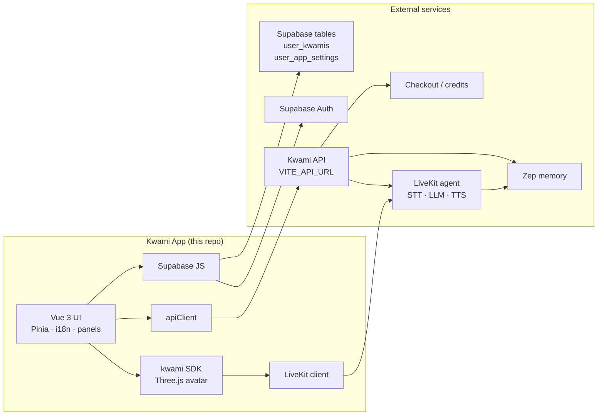
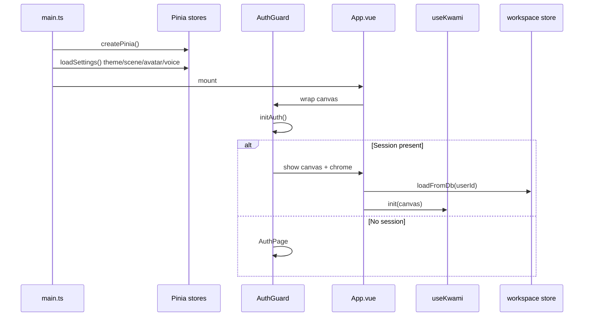

# Architecture overview

Kwami App is a **single-page Vue 3 client**. It renders a WebGL companion on a full-viewport canvas, talks to a FastAPI-style backend over HTTP, and opens a LiveKit room when the user connects a voice session.

The app does not run the language model, speech-to-text, or text-to-speech itself. Those live on the backend agent. The browser owns presentation, local UI state, and the 3D scene.



## Process model

| Process | Runs where | Responsibility |
| --- | --- | --- |
| Vue app | Browser (or Tauri webview) | Auth gate, sidebar, panels, canvas host |
| `kwami` SDK | Same process | Three.js scene, LiveKit room, soul, client tools |
| Kwami API | `VITE_API_URL` | Tokens, catalogues, memory CRUD, credits, channels, apps |
| LiveKit agent | LiveKit Cloud / self-hosted | Real-time voice pipeline and server tools |
| Supabase | Cloud project | OAuth / wallet sign-in, `user_kwamis`, `user_app_settings` |
| Zep | Behind the API | Long-term graph memory (never called from the browser) |

The frontend **does not** ship Zep credentials. The SDK's in-browser `memory` class is a stub. Recall and graph mutations go through `/memory/*` on the API. See [Memory](../concepts/memory.md).

## Boot sequence



`main.ts` hydrates theme, scene, avatar, and voice from `localStorage` **before** mount so the first paint matches the last session. Workspace rows (named companions and their saved configs) load from Supabase only after auth.

## Directory map

```
kwami-app/
├── docs/                 # This documentation
├── e2e/                  # Playwright specs
├── public/               # Static assets (sphere.svg, welcome.mp3)
├── src/
│   ├── assets/           # Global CSS
│   ├── components/       # Auth, sidebar, panels, memory, UI primitives
│   ├── composables/      # Kwami lifecycle, APIs, avatar sync
│   ├── constants/        # Panel icons, language flags
│   ├── i18n/             # vue-i18n messages (en, es)
│   ├── lib/              # apiClient, supabase, catalog cache
│   ├── presets/          # Avatar, scene, theme, soul presets
│   ├── stores/           # Pinia
│   ├── styles/           # Feature CSS
│   ├── types/            # Ambient typings
│   ├── utils/            # Color, keyboard, API message i18n
│   ├── App.vue           # Layout + canvas + lazy panels
│   └── main.ts           # App bootstrap
├── src-tauri/            # Tauri 2 desktop shell
├── tests/                # Vitest unit/integration + MSW
├── infra/                # Cloudflare Workers (wrangler.jsonc)
└── .github/workflows/    # CI + Workers deploy
```

## Design principles

1. **One HTTP client.** All backend calls go through [`src/lib/apiClient.ts`](../../src/lib/apiClient.ts). Stores and composables do not call `fetch` for the Kwami API.
2. **One auth token cache.** `getAuthToken()` de-duplicates `supabase.auth.getSession()` and refreshes with skew.
3. **Per-kwami isolation.** Memory, channels, contacts, email, wallet, and calendar are keyed by the active workspace id.
4. **Explicit persistence.** Draft companion config lives in Pinia and is marked dirty; saving to Supabase is a user action.
5. **Window events as a bus.** Transcription, credits, browser sessions, and avatar sync listen on `window` custom events so panels can stay lazy-loaded. See [Events](../reference/events.md).
6. **No secrets in the bundle.** Only `VITE_*` public values ship to the client. Provider API keys stay on the backend. Recorded as [ADRs](../adr/README.md).

## Related pages

- [Frontend architecture](frontend.md)
- [Data flow](data-flow.md)
- [Backend integration](backend-integration.md)
- [Deployment](deployment.md)
- [Security](../security.md)
- [ADRs](../adr/README.md)
