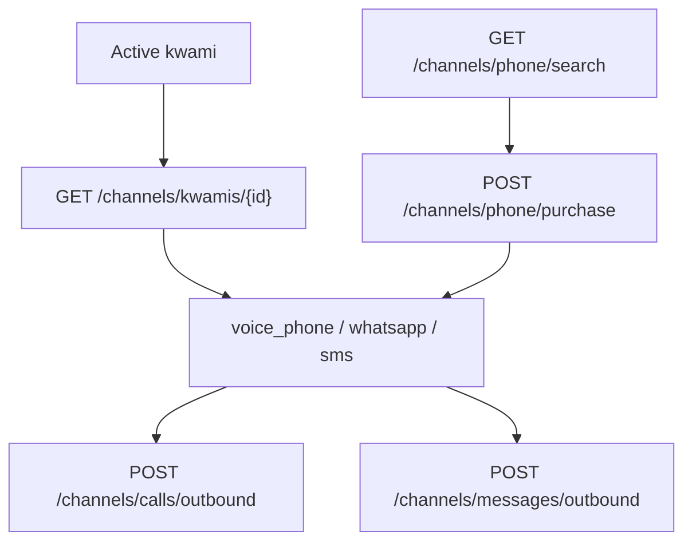

# Communications

Phone, WhatsApp, and SMS are **backend channels** bound to a kwami id. The client lists them, provisions numbers, and starts outbound calls/messages.

## Stores and APIs

| Module | Role |
| --- | --- |
| `useCommunicationsApi` | HTTP: snapshot, search, purchase, release, WhatsApp configure, outbound call/SMS |
| `useCommunicationsStore` | Preferred channel ids, number-search filters, compose drafts (workspace snapshot `telephony`) |
| `useCommunicationsPanel` | Shared panel logic |
| Apps: Phone / WhatsApp / SMS | Outbound UX |
| Settings: Communications | Number inventory and activation |

Channel kinds: `voice_phone` | `whatsapp` | `sms`.

Money-moving or side-effecting calls (`purchase`, `release`, `outbound`, `twilio-direct`) set `retry: false`. Outbound calls allow a 60s timeout (`waitUntilAnswered`).

`startTwilioDirectTestCall` hits Twilio REST only — no LiveKit room — for PSTN debugging.

## Apps vs settings

- **Settings → Communications** — provision / release numbers, WhatsApp sender config
- **Apps → Phone / WhatsApp / SMS** — call and message using preferred channels

Preferred ids persist in the workspace config so each companion can have its own numbers.
