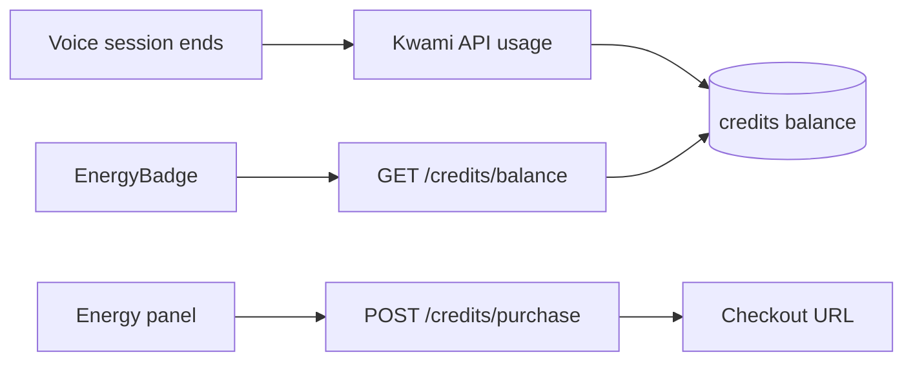

# Credits (energy)

Voice minutes and model tokens are metered as **credits**. The UI calls them Energy (`EnergyBadge`, Energy panel, sidebar id `credits`).

Internally the API uses **micro-credits**: `1000` micro-credits = `1` displayed credit (`MICRO_CREDITS_PER_CREDIT`).

## Store

[`src/stores/credits.ts`](../../src/stores/credits.ts) + [`useCreditsApi.ts`](../../src/composables/useCreditsApi.ts).

| Getter | Meaning |
| --- | --- |
| `displayBalance` | `floor(balance / 1000)` |
| `balanceCredits` | API-provided credit units |
| `hasCredits` | `balance > 0` |
| `lifetimePurchased` / `lifetimeUsed` | Lifetime totals in display units |

`init()` on sign-in loads balance, packs, transactions, and usage logs.

On `kwami:disconnected`, `App.vue` reloads balance and usage — the backend reports the session then.

## Routes

| Method | Path | Auth | Notes |
| --- | --- | --- | --- |
| GET | `/credits/balance` | yes | Current wallet |
| GET | `/credits/packs` | no | Public catalogue |
| POST | `/credits/purchase` | yes | `{ pack_id, success_url, cancel_url }` → `checkout_url`. No retries, 30s timeout |
| GET | `/credits/transactions` | yes | Ledger |
| GET | `/credits/usage` | yes | Per-model line items (`stt` \| `llm` \| `tts` \| `realtime`) |

A 402 from `POST /token` is not a credits route; `useKwami` still maps it to `kwami:insufficient-credits` and a toast (`apiErrors.insufficientCredits`).
