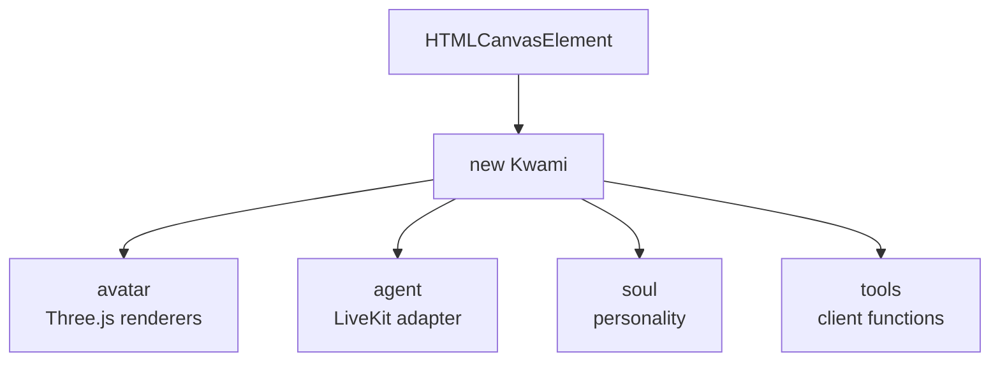

# Kwami runtime

The [Kwami](https://github.com/kwami-labs/kwami) SDK is the companion engine. This app creates **one** `Kwami` instance, holds it in `useKwami`, and exposes it on `window.kwami` for debugging.



## Lifecycle

| Function | When | Effect |
| --- | --- | --- |
| `init(canvas, renderer, options)` | Canvas appears after auth | Constructs `Kwami`, wires speech events to `window` |
| `connect()` | User hits listen / connect | Token + room + `syncAllConfigToBackend` |
| `disconnect()` | User stops | Leaves the room, removes orphaned `<audio>` nodes |
| `switchRenderer(type)` | Shortcut or panel | `avatar.switchRenderer`, `kwami:rendererChanged` |
| `dispose()` | `App.vue` unmount / HMR | Drops WebGL, LiveKit, audio graph |

`dispose()` nulls the singleton **before** awaiting `instance.dispose()` so nothing re-enters mid-teardown. Browsers cap live WebGL contexts (~16); leaking one per HMR reload will evict the working scene.

## Config passed at init

`useKwami.init` builds a `KwamiConfig`:

- **avatar** — renderer (`blob-xyz` by default), blob colors/spikes, orbit controls
- **agent** — `adapter: 'livekit'`, URL, token endpoint, `memoryUserId`, voice snapshot, optional `onSearchResults`
- **soul** — name, personality, traits, style, length, tone

There is **no `memory` block**. The SDK's browser `Memory` class is a stub (`addMessage` no-ops, `search` returns `[]`). Putting Zep keys here would also leak them through `VITE_*`. Real recall is the backend `/memory/*` API.

Saved renderer parameters are applied after init via the avatar sync composables (`useBlobXyzSync`, `useBlackHoleSync`, …) when `kwami:configApplied` fires.

## Connection payload

`connect()` does not call `agent.connect` alone. It calls `kwami.connect(memoryUserId)` so the first data payload includes `kwamiId`, soul, voice, and tools. The Python agent applies that full config on join.

Then `syncAllConfigToBackend` repeats the same domains in case a panel later changes them:

1. Soul
2. Voice enhancements + VAD
3. LLM live params
4. TTS or realtime voice
5. STT model
6. Client tool definitions
7. Memory retrieval (`lean` / `balanced` / `rich`)

## Speech events

| SDK hook | Window event |
| --- | --- |
| `agent.onUserSpeech` | `kwami:message` `{ role: 'user', content }` |
| `agent.onAgentText` | `kwami:message` `{ role: 'assistant', content }` |
| `agent.onInterimTranscript` | `kwami:interim` |
| `agent.onStateChange` | `kwami:stateChanged`, `kwami:disconnected` |

`useTranscriptionState` persists lines for the History panel. `sessionPrepare` runs **before** the room can emit so the first utterance is not wiped by `beginNewLiveSession`.

## Memory user id

```
kwami_{supabaseUserId}_{activeWorkspaceId}
```

Anonymous fallback: `kwami_anonymous` or `kwami_anonymous_{id}`. Each companion has its own Zep user on the backend.

## Linking a local SDK

See [Getting started](../guides/getting-started.md#local-kwami-sdk).
