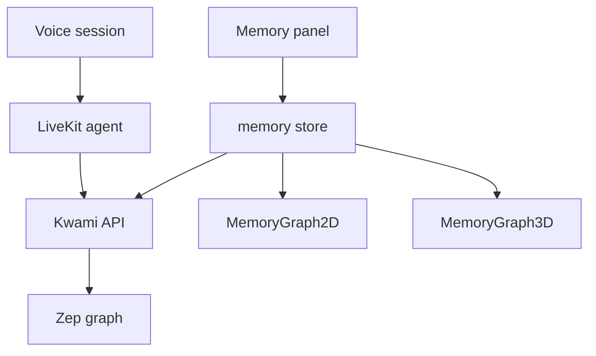

# Memory

Each companion has a long-term **knowledge graph** (entities, facts, messages) stored in [Zep](https://www.getzep.com/) behind the Kwami API. The browser never holds a Zep key.



## Identity

```
memoryUserId = kwami_{authUserId}_{activeKwamiId}
```

All routes are `/memory/{memoryUserId}/…`. Deleting a companion issues `DELETE /memory/{memoryUserId}`.

## Graph model

| Record | Meaning |
| --- | --- |
| Node | Entity (`uuid`, `name`, `summary`, `labels`) |
| Edge | Fact linking nodes (`fact`, `name`, validity window) |
| Message | Transcript line (`role`, `content`, `thread_id`) |
| Community | Cluster of related nodes |
| Duplicate pair | Suggested merge (`keep` / `remove`, score) |

## Loading

`useMemoryStore.load()`:

1. First page of edges + nodes (100 each) and all messages, in parallel
2. Remaining pages **awaited** with a request guard
3. Switching companions aborts in-flight pages; `isCurrent()` prevents writes

Communities and duplicates are loaded on demand. Duplicate fetch **throws** on 503 (Zep down) so the UI cannot look like a clean graph.

## Retrieval settings

`voiceStore.memoryUI.contextSize` maps to agent runtime config:

| Preset | `maxContextMessages` | `minFactRelevance` |
| --- | --- | --- |
| `lean` | 4 | 0.7 |
| `balanced` | 10 | 0.5 |
| `rich` | 16 | 0.35 |

`includeFacts` is a separate toggle. These are pushed on connect via `syncConfigToBackend('memory', …)`.

## Visualization

[`src/components/memory/`](../../src/components/memory/) — 2D and 3D graphs, legend, node details. The 3D view is excluded from unit-test coverage (WebGL); exercise it in the browser.

`MemoryGraph.vue` can `POST /memory/{userId}/connect` to persist a user-drawn edge.

## What the SDK does not do

`Kwami`’s frontend `memory` object is an explicit stub. Do not add a `memory` block to `KwamiConfig` in this app.
