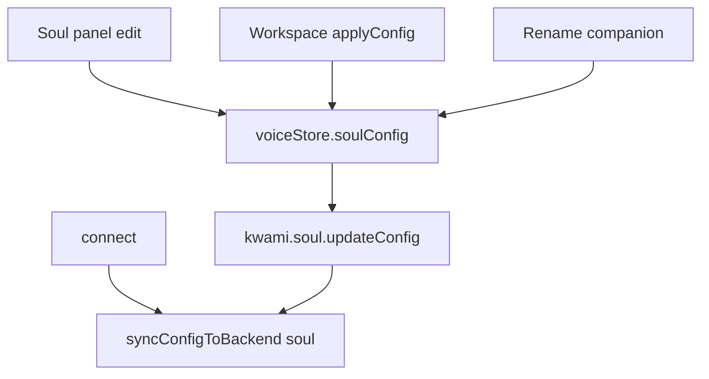

# Soul

Soul is the companion's **personality contract**: name, prompt, traits, and conversational style. It is not a model. The LLM still comes from the voice store; soul is the system-level instruction the agent applies.

## Fields

From `voiceStore.soulConfig` / `kwami.soul.updateConfig`:

| Field | Role |
| --- | --- |
| `name` | Spoken / displayed identity (kept in sync with the workspace name) |
| `personality` | Free-text description |
| `systemPrompt` | Extra system instructions |
| `traits` | String tags |
| `conversationStyle` | e.g. `friendly` |
| `responseLength` | `short` \| `medium` \| `long` |
| `emotionalTone` | `warm` \| `neutral` \| `enthusiastic` \| `calm` |
| `emotionalTraits` | Numeric / structured traits |
| `language` | Preferred spoken language (UI) |

Templates: [`src/presets/agent/soul-presets.ts`](../../src/presets/agent/soul-presets.ts). The Soul panel keeps `selectedCategory` / `selectedTemplateId` in `soulUI`.

## When it is applied

`App.vue` `applySavedSoulState()` runs on init and on `kwami:configApplied`. If already connected, it also `syncConfigToBackend('soul', …)` so the live agent matches the new companion immediately.

Creating or renaming a workspace writes `soulConfig.name`.
