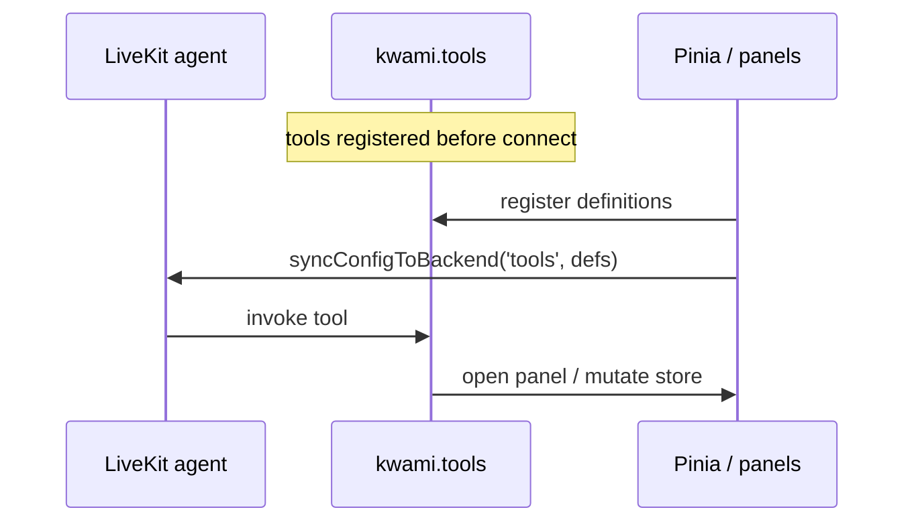

# Tools

The LiveKit agent can invoke **client tools** registered on `kwami.tools`. This app registers a workspace-oriented set in [`useWorkspaceAgentTools.ts`](../../src/composables/useWorkspaceAgentTools.ts).

Definitions are synced **every connect**. Registration happens before the room opens; connect is the reliable point to tell the backend what the UI can execute.

## What tools can do

High-level domains (see `UI_CONTROL_DOMAINS` and `WORKSPACE_PANELS` in the composable):

- Open / size panels (settings and apps), including aliases (`energy` → `credits`, `inbox` → `email`)
- Theme, avatar, scene, voice, enhancements
- Soul and models
- Email compose / inbox filters
- Calendar events
- Transcription / history
- Reset avatar / theme / scene
- Memory recall — list and forget memories, jump between conversations, clear the transcript ([`useRecallAgentTools.ts`](../../src/composables/useRecallAgentTools.ts))
- Companion admin — create, rename and delete kwamis, read the credit balance, sign out, randomize appearance ([`useKwamiAdminAgentTools.ts`](../../src/composables/useKwamiAdminAgentTools.ts))
- Extras — export / import a theme, read and reset performance metrics, create a wallet ([`useWorkspaceExtrasAgentTools.ts`](../../src/composables/useWorkspaceExtrasAgentTools.ts))

Copy for tool names and errors is in `workspaceAgentTools.locale.ts`.

## Registering a new tool set

A `use*AgentTools` composable is only reachable if `registerTools()` in
[`useWorkspaceAgentTools.ts`](../../src/composables/useWorkspaceAgentTools.ts) calls its
`register*` function. Those last three domains spent three releases written, translated and
unit-tested but never registered — 19 tools the model was never told about, with nothing
failing anywhere. `tests/unit/toolRegistrars.test.ts` now fails if a composable defines a
registrar that nothing calls.

A client tool also needs a matching capability block in `kwami-lk-agent`
(`agent/src/domain/capabilities.py`), or the agent will not reach for it however well it is
described here.

## Server vs client

| Kind         | Runs        | Examples                                   |
| ------------ | ----------- | ------------------------------------------ |
| Client tools | Browser     | Open Memory panel, set accent, draft email |
| Server tools | Agent / API | Web search, memory write, outbound SMS     |

Web search results arrive as data-channel messages and are shown by `useSearchResults` / `SearchOrbitCards`. Browser-use sessions emit `kwami:browser_session` and open `BrowserPanel`.

## MCP

The Tools **panel** is the UI for inspecting / toggling MCP and custom tools the backend exposes. The workspace agent tools above are always registered by this app and are separate from user-configured MCP servers.
