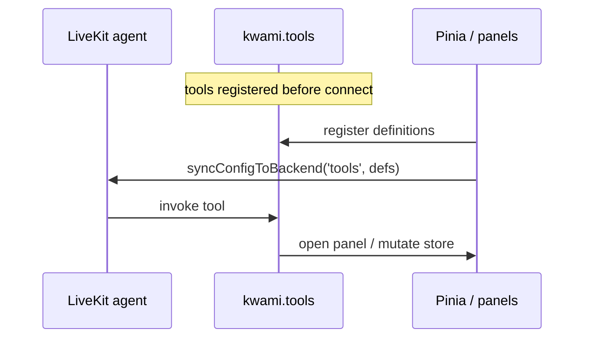

# Tools

The LiveKit agent can invoke **client tools** registered on `kwami.tools`. This app registers a workspace-oriented set in [`useWorkspaceAgentTools.ts`](../../src/composables/useWorkspaceAgentTools.ts).

Definitions are synced **every connect**. Registration happens before the room opens; connect is the reliable point to tell the backend what the UI can execute.

## What tools can do

High-level domains (see `UI_CONTROL_DOMAINS` and `WORKSPACE_PANELS` in the composable):

- Open / size panels (settings and apps), including aliases (`energy` → `credits`, `inbox` → `email`)
- Theme, avatar, scene, voice, enhancements
- Soul and models
- Email compose / inbox filters
- Calendar events
- Transcription / history
- Reset avatar / theme / scene

Copy for tool names and errors is in `workspaceAgentTools.locale.ts` (en + es).

## Server vs client

| Kind | Runs | Examples |
| --- | --- | --- |
| Client tools | Browser | Open Memory panel, set accent, draft email |
| Server tools | Agent / API | Web search, memory write, outbound SMS |

Web search results arrive as data-channel messages and are shown by `useSearchResults` / `SearchOrbitCards`. Browser-use sessions emit `kwami:browser_session` and open `BrowserPanel`.

## MCP

The Tools **panel** is the UI for inspecting / toggling MCP and custom tools the backend exposes. The workspace agent tools above are always registered by this app and are separate from user-configured MCP servers.
