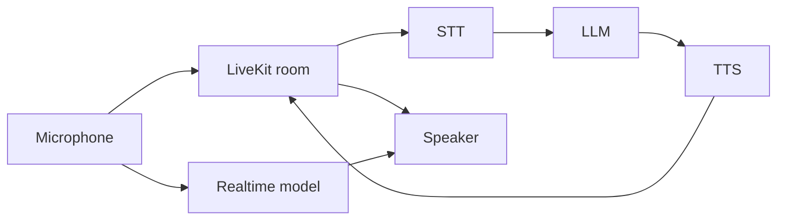

# Voice pipeline

Speech is a **server-side** pipeline. The browser captures the microphone, streams it through LiveKit, and plays agent audio. Model selection lives in the voice store and is synced on connect.

Two modes (`voiceStore.pipelineMode`):

| Mode | Path | Typical providers |
| --- | --- | --- |
| `stt-llm-tts` | Separate speech-to-text, chat model, text-to-speech | Deepgram + OpenAI + OpenAI TTS |
| `realtime` | Single speech-to-speech model | OpenAI Realtime |

## Store defaults

[`src/stores/voice.ts`](../../src/stores/voice.ts), persisted under `kwami-voice-config`:

| Domain | Default |
| --- | --- |
| STT | Deepgram `nova-2`, language `en` |
| LLM | OpenAI `gpt-4o-mini`, temperature 0.7, 1024 max tokens |
| TTS | OpenAI `tts-1`, voice `nova`, speed 1.0 |
| Realtime | OpenAI `gpt-4o-realtime-preview`, voice `alloy` |

The store also holds **panel UI** (sorts, expanded providers, voice filters) and **soul / enhancements / memory UI** so those screens survive panel unmount.

`voiceConfig` is the object passed into the SDK on init and connect.

## Catalogues

Panels do not hard-code every model. They fetch:

| Composable | Routes |
| --- | --- |
| `useModelsApi` | `/models/llm`, `/models/stt`, `/models/tts`, `/models/realtime`, plugins + capabilities |
| `useVoicesApi` | `/voices/tts` (and per-provider) |
| `useLanguagesApi` | `/languages/stt`, `/languages/tts` |

Failures fall back to bundled lists. See [`catalogResource.ts`](../../src/lib/catalogResource.ts).

## Enhancements

Synced under the `voice` backend domain:

- Turn detection (mode, model, endpointing delays, interruptions)
- Noise cancellation
- Echo cancellation, AGC
- Preemptive generation
- VAD provider, threshold, min speech / silence

UI: Enhancements panel.

## Live updates

After connect, changing TTS voice calls `agent.updateTtsLive` (or `updateRealtimeLive`). STT uses `updateSttLive`. LLM temperature / max tokens go through `syncConfigToBackend('llm', …)`.

## Credits

Token minting and per-session usage happen on the API. A 402 from the token endpoint becomes `kwami:insufficient-credits`. After disconnect, the credits store reloads balance and usage logs (STT / LLM / TTS / realtime line items).
