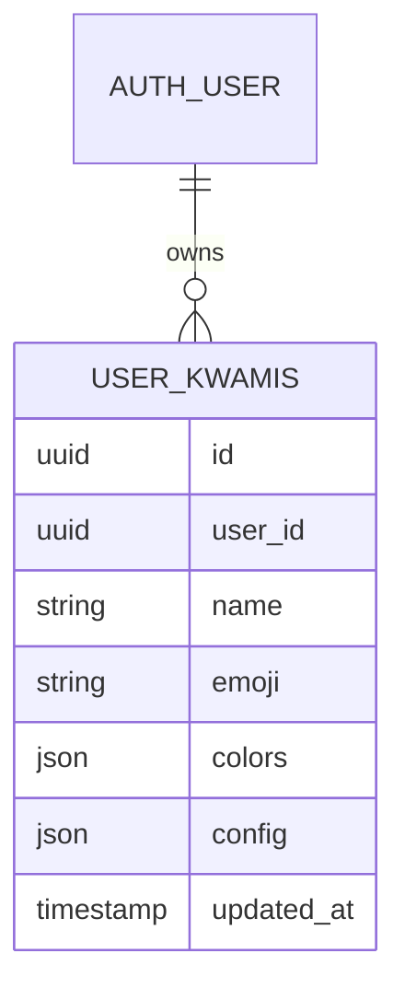

# Workspaces

A workspace is one **companion**: a name, a color triple, and a JSON config that restores avatar, voice, scene, theme, and telephony.



Store: [`src/stores/workspace.ts`](../../src/stores/workspace.ts).

## Identity

| Field | Meaning |
| --- | --- |
| `id` | Supabase row id (or a local `kwami_{timestamp}_{rand}` fallback) |
| `name` | Display name; also written onto `voiceStore.soulConfig.name` |
| `emoji` | Optional glyph in the selector |
| `colors` | `{ x, y, z }` hex — blob axes / selector swatch |
| `config` | Draft snapshot (reactive, local) |
| `savedConfig` | Last persisted snapshot |
| `hasUnsavedConfig` | `JSON.stringify` inequality of the two |

`activeWorkspaceId` is the companion the canvas, memory id, and apps are bound to.

## Snapshot shape

Produced by `useKwamiConfigSync.getConfig()`:

```ts
{
  avatar: unknown    // avatar store snapshot
  voice: unknown     // pipeline, models, soul, enhancements, memory UI
  scene: unknown     // backgrounds, overlays, effects
  theme: unknown     // mode, accent, glass, UI, accessibility
  telephony: unknown // preferred channels, compose drafts
}
```

Cloned with `JSON.parse(JSON.stringify(…))` so Pinia proxies never hit PostgREST.

## Load / create / delete

| Action | Persistence |
| --- | --- |
| `loadFromDb(userId)` | `select` `user_kwamis` ordered by `updated_at` desc |
| Empty result | Inserts a randomly named companion |
| Load error | `ensureLocalWorkspace()` — in-memory only |
| `addKwami` | Insert row or local object; can clone active config or randomize |
| `updateKwami` | Name / colors |
| `saveActiveConfig` | Writes `config` JSON |
| `deleteKwami` | Deletes the row and best-effort `DELETE /memory/{memoryUserId}` |

Random names are adjective + noun (`Cosmic Spark`, `Neon Drift`, …) with three random hex colors.

## Dirty tracking

`useKwamiConfigWatchers` stringifies `getConfig()` after every store mutation and writes the draft locally. Switching `activeWorkspaceId`:

1. Applies that row's `config` (if non-empty)
2. Waits a tick for the draft watcher
3. Rebases `savedConfig` to the **normalized** store output so newly added schema fields do not permanently mark the companion dirty

Save / revert are user actions in the sidebar (`saveCurrentConfig` / `revertCurrentConfig`).

## UI

- `KwamiSelector`, `NewKwamiModal`, `EditKwamiModal`, `DeleteKwamiConfirm`
- `useKwamiActions` owns toasts and the memory purge
