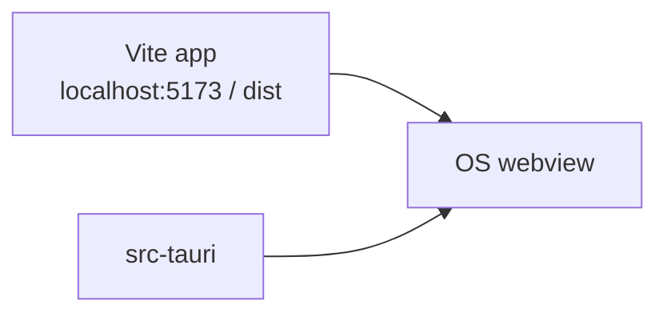

# Desktop (Tauri)

Kwami App can run as a native window via [Tauri 2](https://v2.tauri.app/). The frontend is the same Vite app; Rust only hosts the webview.



## Layout

```
src-tauri/
├── Cargo.toml
├── tauri.conf.json
├── build.rs
├── capabilities/default.json
├── icons/
└── src/main.rs
```

[`tauri.conf.json`](../../src-tauri/tauri.conf.json):

| Field | Value |
| --- | --- |
| Product name | `kwami-app` |
| Identifier | `com.tauri.dev` (replace before shipping) |
| Dev URL | `http://localhost:5173` |
| `beforeDevCommand` | `bun run dev` |
| `beforeBuildCommand` | `bun run build` |
| `frontendDist` | `../dist` |
| Window | 800×600, title `KWAMI` |

## Run

Install the [Tauri 2 prerequisites](https://v2.tauri.app/start/prerequisites/) for your OS (WebView2 on Windows, WebKitGTK on Linux, Xcode CLT on macOS). Then:

```bash
bun run tauri dev
```

Production installers:

```bash
bun run tauri build
```

## Webview constraints

The HTTP client avoids `AbortSignal.any` and composes abort signals itself. Linux Tauri uses WebKitGTK, which historically lagged Chromium on that API.

`vite-plugin-pwa` still builds a service worker; it is unused in the desktop webview and harmless.

## Shipping checklist

- Change `identifier` from the Tauri default
- Replace placeholder icons in `src-tauri/icons/`
- Set CSP in `tauri.conf.json` (`csp` is currently `null`)
- Confirm LiveKit and Supabase URLs are reachable from the packaged app (CORS / deep links)
- Do not embed secrets; the desktop binary still uses `VITE_*` baked in at build time
