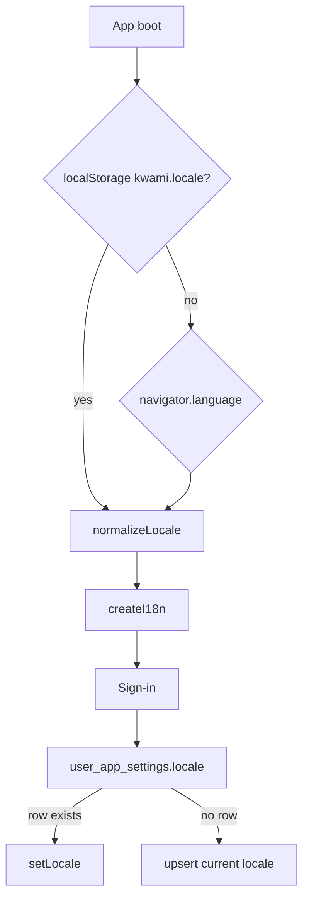

# Internationalization

The UI uses [`vue-i18n`](https://vue-i18n.intlify.dev/) in composition mode (`legacy: false`).

## Locales

| Code | File | Status |
| --- | --- | --- |
| `en` | [`src/i18n/translations/en.ts`](../../src/i18n/translations/en.ts) | Default / fallback |
| `es` | [`src/i18n/translations/es.ts`](../../src/i18n/translations/es.ts) | Full UI |

Agent-tool copy lives in [`src/i18n/workspaceAgentTools.locale.ts`](../../src/i18n/workspaceAgentTools.locale.ts) and is merged into both locales.

## Resolution order

`normalizeLocale` accepts only `en` | `es`; anything else becomes `en`.

`setLocale` writes `localStorage` immediately. `saveUserLocaleToDb` upserts `user_app_settings` for signed-in users ([`src/lib/userAppSettings.ts`](../../src/lib/userAppSettings.ts)).

`intlLocaleTag()` maps to `en-US` / `es-ES` for `Intl` date formatting.

## Adding a string

1. Add the key to `en.ts`
2. Add the same key to `es.ts`
3. Read it with `const { t } = useI18n()` and `t('namespace.key')`

Keep keys grouped by panel or feature (`kwamiActions.*`, `apiErrors.*`, …).

API error bodies are passed through [`src/utils/translateApiMessage.ts`](../../src/utils/translateApiMessage.ts) so backend `detail` strings can map to i18n keys instead of leaking English into the Spanish UI.

## Adding a locale

1. Add the code to `SUPPORTED_LOCALES` in [`src/i18n/index.ts`](../../src/i18n/index.ts)
2. Create `src/i18n/translations/<code>.ts`
3. Add agent-tool strings
4. Extend `intlLocaleTag`
5. Add a language option in the Account / Theme UI that already calls `setLocale`
