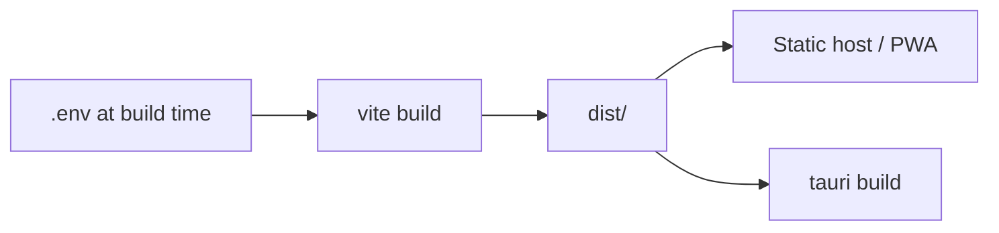

# Releasing

This package is `0.1.0` and **private** (`"private": true`). There is no npm publish. Releases are Git tags plus whatever hosts the static Vite build (and optional Tauri installers).

## Versioning

[Semantic Versioning](https://semver.org/) for tags (`vMAJOR.MINOR.PATCH`):

| Bump | When |
| --- | --- |
| **PATCH** | Client bug fix, no API contract change |
| **MINOR** | New panel, tool, or env var; existing flows still work |
| **MAJOR** | Breaking client contract (removed `VITE_*`, changed `/token` body, dropped a store snapshot field without migration) |

Keep [CHANGELOG.md](../../CHANGELOG.md) in [Keep a Changelog](https://keepachangelog.com/) form. Move `[Unreleased]` notes into the new version section in the same PR as the version bump.

## Checklist

1. `bun run typecheck && bun run lint:check && bun run format:check && bun run test:unit`
2. `bun run test:e2e` (or rely on CI)
3. `bun run build` with the **production** `.env` you intend to ship (`VITE_*` is baked in)
4. Update `package.json` `version` and `CHANGELOG.md`
5. Tag `vX.Y.Z` on `main` after merge
6. Attach Playwright / coverage artifacts only if they help the notes — never attach `.env`

## What gets baked into the binary

Changing API or LiveKit URLs after ship requires a **rebuild**. There is no runtime env file in the browser or the Tauri webview.

## Desktop extras

Before a signed Tauri ship: change `identifier` from `com.tauri.dev`, replace icons, set CSP. [Desktop](desktop.md).

## Security releases

Fixes land on `main` first. Credit reporters in the changelog if they want. Process: [SECURITY.md](../../SECURITY.md).
