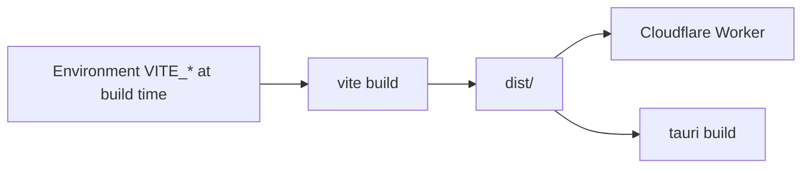

# Releasing

Versions, tags, the GitHub Release and [`CHANGELOG.md`](../../CHANGELOG.md) are cut automatically by [semantic-release](https://semantic-release.gitbook.io) after `ci` goes green on `main` or `stg`. Nothing is hand-maintained. See [CONTRIBUTING.md#releases](../../CONTRIBUTING.md#releases).

```text
merge a PR into main or stg
        │
        ▼
      ci.yml ── red ──▶ nothing
        │ green
        ▼
      cd.yml
        ├─ release   semantic-release → CHANGELOG.md + tag + GitHub Release
        └─ deploy    wrangler → channel Worker
```

The client is pre-1.0: breaking changes bump the minor, everything else bumps the patch. `v0.1.0` is a baseline tag created on the first `cd` run if no `v*` tag exists.

Do not push tags by hand. Do not bump `package.json` `version` in a pull request. The PR title must be a Conventional Commit — it becomes the squash subject, and semantic-release reads that subject.

## What gets baked into the binary



Changing API or LiveKit URLs after ship requires a **rebuild**. There is no runtime env file in the browser or the Tauri webview.

## Desktop extras

Before a signed Tauri ship: change `identifier` from `com.tauri.dev`, replace icons, set CSP. [Desktop](desktop.md).

## Security releases

Fixes land on `dev`, then promote `dev → stg → main`. Credit reporters in the changelog if they want. Process: [SECURITY.md](../../SECURITY.md).
