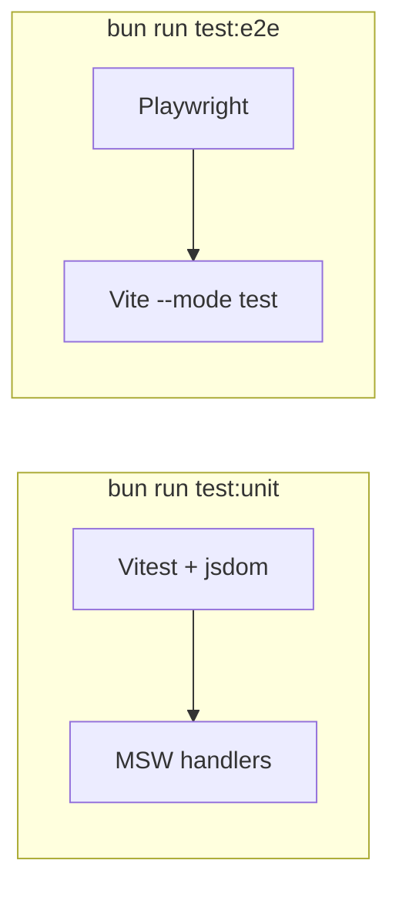

# Testing

Two layers: **Vitest** (unit / integration in jsdom) and **Playwright** (Chromium e2e).



## Unit and integration

```bash
bun run test:unit
bun run test:unit --coverage
bun run test:watch
```

Config: [`vitest.config.ts`](../../vitest.config.ts). It merges `vite.config.ts` so `@` and the `iconify-icon` custom-element option work in tests.

| Path | Role |
| --- | --- |
| `tests/setup.ts` | Global setup |
| `tests/helpers/mount.ts` | `mountWithPinia` |
| `tests/mocks/kwami.ts` | Stub `kwami` SDK |
| `tests/mocks/server.ts` | MSW server |
| `tests/mocks/handlers.ts` | Default HTTP fixtures |
| `tests/unit/*.test.ts` | Specs |

Injected env (not your `.env`):

```
VITE_API_URL=http://localhost:8080
VITE_SUPABASE_URL=http://localhost:54321
VITE_SUPABASE_PUBLISHABLE_KEY=sb_publishable_test
VITE_LIVEKIT_URL=wss://livekit.test
```

Coverage (v8): text, HTML, lcov. Thresholds are a ratchet — raise, do not lower:

| Scope | Lines / functions / statements | Branches |
| --- | --- | --- |
| Global | 40 | 40 |
| `src/stores/**` | 70 | 60 |
| `src/utils/**` | 90 | 80 |

Excluded from coverage: `main.ts`, translation dumps, presets, welcome WebGL, `MemoryGraph3D.vue`, `useSceneBackground.ts`.

## End-to-end

```bash
bun run test:e2e
bun run test:e2e:ui
```

Config: [`playwright.config.ts`](../../playwright.config.ts).

- Starts `bun run dev --mode test` so [`.env.test`](../../.env.test) is used
- Chromium only
- `reuseExistingServer: false` so a personal `bun run dev` cannot leak real keys into e2e
- Override the port with `PLAYWRIGHT_PORT` if 5173 is busy
- CI: 2 retries, 1 worker, GitHub + HTML reporters

Specs live in `e2e/`:

| File | Coverage |
| --- | --- |
| `auth.spec.ts` | Welcome / auth gate |
| `workspace.spec.ts` | Companion chrome |
| `panels.spec.ts` | Sidebar panels |

## Continuous integration

[`.github/workflows/ci.yml`](../../.github/workflows/ci.yml) on `pull_request` and `push` to `main`:

1. `bun install --frozen-lockfile`
2. typecheck, lint, format
3. unit tests with coverage (artifact retained 7 days)
4. production build
5. Playwright + Chromium deps; upload the report on failure

## Writing tests

- Prefer MSW over mocking `apiClient` internals
- Use `mountWithPinia` for components that touch stores
- Do not hit real Supabase, LiveKit, or the production API
- For new stores, keep coverage above the `src/stores/**` threshold
