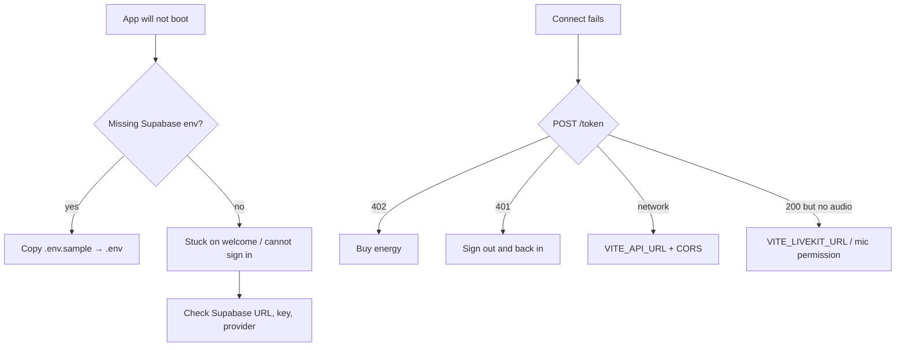

# Troubleshooting

Symptoms first. Environment reference: [Environment](environment.md).

## Configuration error on startup

`src/lib/env.ts` requires `VITE_SUPABASE_URL` and `VITE_SUPABASE_PUBLISHABLE_KEY`. Copy `.env.sample` to `.env` and restart `bun run dev`. Vite only picks up env changes after a restart.

## Welcome rings never end / Auth page errors

| Check | Notes |
| --- | --- |
| Supabase URL + publishable key | Wrong values used to hang `loading`; they now surface an error |
| Provider enabled | `VITE_AUTH_PROVIDERS` must match the Supabase dashboard. An extra provider returns 400 |
| Popup blocked | OAuth uses a popup; allow popups for `localhost:5173` |
| Redirect URLs | Add `http://localhost:5173/**` to the Supabase Auth redirect allowlist |
| Email provider off | Email + password 400s with "Email logins are disabled" — enable it under Authentication -> Providers |
| Sign-up mail never arrives | Expected when the address already has a confirmed account; the form says so and switches to sign in |
| "Phantom was not detected" | The extension is missing, or it is present but another Solana wallet claimed `window.solana` — the app checks `window.phantom.solana` first |
| Web3 tab missing | Add `phantom` to `VITE_AUTH_PROVIDERS` and enable Authentication -> Web3 (Solana) |

## Avatar only, no voice

The canvas does not need the API. Voice does.

1. `VITE_API_URL` reachable (`curl -I "$VITE_API_URL/credits/packs"`)
2. `POST /token` with a real Bearer returns a JWT (not 401/402/5xx)
3. `VITE_LIVEKIT_URL` is `wss://…` and the project allows your origin
4. Browser microphone permission granted

## “Insufficient credits” toast

`POST /token` returned **402**. Load Energy after sign-in; the backend bills when a session ends. This is not a LiveKit URL problem.

## Memory panel empty or error

The store no longer pretends an outage is an empty graph.

- **503** — Zep or `/memory/*` down
- **Empty after a new companion** — expected until the first session writes nodes
- **Wrong graph after switching** — should not happen; file a bug if it does (`createRequestGuard`)

## Companions vanish on refresh

`user_kwamis` missing or RLS not `auth.uid()`. The store falls back to an in-memory workspace that dies with the tab.

## Digit shortcut opens the wrong panel

Shortcuts follow [`src/constants/panels.ts`](../../src/constants/panels.ts). WhatsApp / SMS keys exist only when a phone number is provisioned. If you added a panel and skipped that file, the sidebar and keys will disagree.

## PWA / install button missing

Installability needs a secure context (localhost or HTTPS), a valid manifest, and a registered service worker. Account → download uses the sphere icon. Chromium e2e stubs CDNs; do not debug installability inside Playwright.

## Tauri: requests abort strangely

`apiClient` composes `AbortSignal`s without `AbortSignal.any` (WebKitGTK). If you reintroduce `AbortSignal.any`, Linux desktop breaks. [Desktop](desktop.md).

## `bun run build` fails typecheck

`vue-tsc -b` is part of `build`. Run `bun run typecheck` alone. Do not add `any` escapes to silence it.

## Tests hit my real `.env`

They should not. Vitest injects `test.env` in `vitest.config.ts`. Playwright starts Vite with `--mode test` (`.env.test`) and `reuseExistingServer: false`. If you see your personal API in a spec, the stub host list is incomplete.

## Still stuck

1. `bun run typecheck && bun run lint:check && bun run test:unit`
2. Reproduce with the network tab: `/token`, `/credits/balance`, LiveKit WS
3. Open an issue with the [bug template](../../.github/ISSUE_TEMPLATE/bug_report.yml) — no tokens, no transcripts
