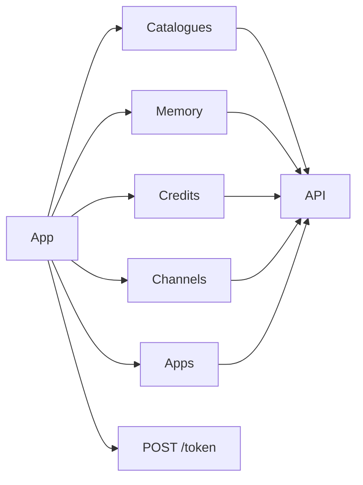

# Backend API

Base URL: `VITE_API_URL`. Client: [`src/lib/apiClient.ts`](../../src/lib/apiClient.ts). Unless noted, requests send `Authorization: Bearer <Supabase access_token>`.

This is the **contract this app calls**, not a full OpenAPI spec. The backend may expose more.

## Token

| Method | Path | Notes |
| --- | --- | --- |
| POST | `VITE_LIVEKIT_TOKEN_ENDPOINT` | Usually `{API}/token`. Body/query come from the Kwami SDK. 402 → insufficient credits |

## Catalogues

Public-ish lists; still go through `api` (auth on by default except where noted).

| Method | Path | Consumer |
| --- | --- | --- |
| GET | `/models/llm` | `useModelsApi` |
| GET | `/models/llm/plugins` | |
| GET | `/models/stt` | |
| GET | `/models/stt/plugins` | |
| GET | `/models/tts` | |
| GET | `/models/tts/plugins` | |
| GET | `/models/realtime` | |
| GET | `/models/capabilities` | vision / video flags |
| GET | `/voices/tts` | `useVoicesApi` |
| GET | `/voices/realtime` | |
| GET | `/languages` | `useLanguagesApi` |
| GET | `/languages/stt` | |
| GET | `/languages/tts` | |
| GET | `/languages/realtime` | |

Catalog fetches use a 10s timeout and resolve `null` on failure.

## Memory

`{id}` = `kwami_{userId}_{kwamiId}`.

| Method | Path | Notes |
| --- | --- | --- |
| GET | `/memory/{id}/edges` | `limit`, `offset` |
| GET | `/memory/{id}/nodes` | `limit`, `offset` |
| GET | `/memory/{id}/messages` | + `session_count` |
| GET | `/memory/{id}/communities` | 60s timeout |
| GET | `/memory/{id}/duplicates` | `threshold` |
| PATCH | `/memory/{id}/edge/{uuid}` | `{ fact }` |
| PATCH | `/memory/{id}/node/{uuid}` | `{ name?, summary?, labels? }` |
| DELETE | `/memory/{id}/edge/{uuid}` | |
| DELETE | `/memory/{id}/node/{uuid}` | |
| DELETE | `/memory/{id}` | Wipe graph; 60s |
| POST | `/memory/{id}/merge` | `{ keep_uuid, remove_uuid }`, no retry |
| POST | `/memory/{id}/connect` | Manual edge from the graph UI |

## Credits

| Method | Path | Auth | Notes |
| --- | --- | --- | --- |
| GET | `/credits/balance` | yes | |
| GET | `/credits/packs` | **no** | `{ packs: CreditPack[] }` |
| POST | `/credits/purchase` | yes | `{ pack_id, success_url, cancel_url }` → `checkout_url`. No retry, 30s |
| GET | `/credits/transactions` | yes | `limit`, `offset` |
| GET | `/credits/usage` | yes | `limit`, `offset`, `session_id` |

## Channels

| Method | Path | Notes |
| --- | --- | --- |
| GET | `/channels/kwamis/{kwamiId}` | Snapshot: channels + recent calls/messages |
| GET | `/channels/phone/search` | `kwamiId`, `countryCode`, `areaCode`, `contains`, `limit` |
| POST | `/channels/phone/purchase` | No retry, 30s |
| POST | `/channels/phone/release` | No retry, 30s |
| POST | `/channels/whatsapp/configure` | |
| POST | `/channels/calls/outbound` | No retry, 60s |
| POST | `/channels/calls/twilio-direct` | PSTN debug, no LiveKit |
| POST | `/channels/messages/outbound` | `{ channelKind: 'whatsapp' \| 'sms' }`, no retry |

## Email

| Method | Path |
| --- | --- |
| GET | `/email/account` |
| GET | `/email/check-username` |
| POST | `/email/activate` |
| DELETE | `/email/account?kwami_id=` |
| GET | `/email/inbox` |
| GET | `/email/unread-counts` |
| GET | `/email/messages/{id}` |
| PATCH | `/email/messages/{id}` |
| POST | `/email/send` |

## Contacts

| Method | Path |
| --- | --- |
| GET | `/contacts` |
| POST | `/contacts` |
| PATCH | `/contacts/{id}` |
| DELETE | `/contacts/{id}?kwamiId=` |

## Calendar

| Method | Path |
| --- | --- |
| GET | `/calendar/events` |
| POST | `/calendar/events` |
| PATCH | `/calendar/events/{id}` |
| DELETE | `/calendar/events/{id}` |

## Wallet

| Method | Path |
| --- | --- |
| GET | `/wallets/kwamis/{kwamiId}` |
| POST | `/wallets/kwamis/{kwamiId}` |
| POST | `/wallets/kwamis/{kwamiId}/fund/{route}` |
| POST | `/wallets/allowlist` |

## Error shape

The client normalizes FastAPI bodies:

- `detail` string
- `detail` array of `{ msg }` (422)
- `message` / `error` fallbacks

`ApiError.code`: `insufficient_credits` | `unauthorized` | `forbidden` | `not_found` | `validation` | `rate_limited` | `unavailable` | `server` | `timeout` | `aborted` | `network` | `http`.
