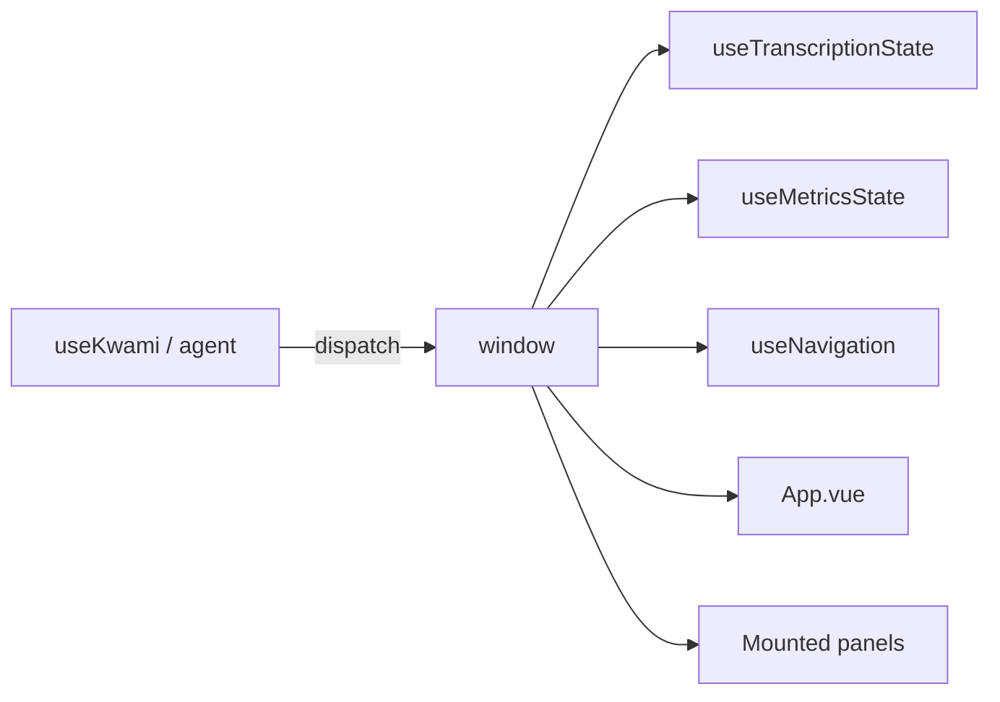

# Window events

Panels stay lazy-loaded, so the app uses `window` `CustomEvent`s as a bus. Names are `kwami:*`.

## Session / speech

| Event | Detail | Producers | Consumers |
| --- | --- | --- | --- |
| `kwami:sessionPrepare` | `{ memoryUserId }` | `connect()` before join | Transcription (open storage key) |
| `kwami:connected` | `{ memoryUserId }` | `connect()` success | History, metrics, info, agent-action |
| `kwami:connectFailed` | — | `connect()` catch | Transcription |
| `kwami:disconnected` | — | agent state / `disconnect()` | Credits refresh, metrics, info, history |
| `kwami:insufficient-credits` | — | token 402 | Toast in `App.vue` |
| `kwami:message` | `{ role, content }` | user/agent speech | History |
| `kwami:interim` | `string` | partial STT | History |
| `kwami:stateChanged` | `'idle' \| 'listening' \| 'thinking' \| 'speaking'` | agent, shortcuts, music, interactions | Avatar, info, history |
| `kwami:metrics` | payload | agent | Metrics panel |

## Avatar / config

| Event | Detail | Producers | Consumers |
| --- | --- | --- | --- |
| `kwami:configApplied` | — | config sync, agent tools | Re-apply avatar + soul + scene |
| `kwami:rendererChanged` | renderer id | `switchRenderer` | Avatar panel |
| `kwami:randomized` | — | randomize helpers | Avatar panel |
| `kwami:randomize-avatar-panel` | — | avatar interactions | `App.vue` runs full panel randomize |
| `kwami:voiceConfigChanged` | — | voice UI | Metrics |
| `kwami:enhancementsChanged` | — | enhancements UI | Metrics |

## Search / browser

| Event | Detail | Producers | Consumers |
| --- | --- | --- | --- |
| `kwami:search_results` | `{ query, results, answer }` | agent data channel | `useSearchResults`, agent-action |
| `kwami:remove_result` | id / url | UI | `useSearchResults` |
| `kwami:browser_session` | `{ action, liveUrl, url, title }` | agent | `useNavigation` (`open` / `update` / `close`) |
| `kwami:nav_command` | extension command | agent (legacy) | `useNavigation` → `postMessage` |
| `kwami:send_data` | payload | navigation | outbound to agent / extension |
| `kwami:ext_nav_state` | state | browser extension | navigation store |
| `kwami:ext_nav_ended` | — | extension | end session |
| `kwami:ext_disconnected` | — | extension | end session |
| `kwami:ext_page_content` | page text | extension | forwarded to agent |
| `kwami:ext_command_result` | result | extension | forwarded to agent |

`kwami:nav_command` is the older extension path. Prefer `kwami:browser_session` for Browser Use Cloud live URLs.

## Adding an event

1. Name it `kwami:<camelOrSnake>` and keep one producer
2. Document it in this table
3. Remove the listener on unmount (or use a singleton composable with a guard flag, as navigation does)
