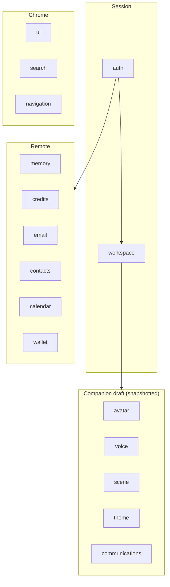

# Stores

All state is Pinia setup stores under [`src/stores/`](../../src/stores/).

## Session

| Store | File | Persistence | Role |
| --- | --- | --- | --- |
| `auth` | `auth.ts` | Supabase session | User, session, popup OAuth, `getAccessToken` |
| `workspace` | `workspace.ts` | `user_kwamis` | Companion list, active id, dirty config |

## Companion draft

These participate in `useKwamiConfigSync` snapshots (except where noted).

| Store | File | Persistence | Snapshot key |
| --- | --- | --- | --- |
| `avatar` | `avatar.ts` | `localStorage` + workspace | `avatar` |
| `avatar.blob-xyz` | `avatar.blob-xyz.ts` | via avatar façade | (nested) |
| `avatar.black-hole` | `avatar.black-hole.ts` | via avatar façade | (nested) |
| `avatar.particles-face` | `avatar.particles-face.ts` | via avatar façade | (nested) |
| `avatar.eye-iris` | `avatar.eye-iris.ts` | via avatar façade | (nested) |
| `voice` | `voice.ts` | `kwami-voice-config` + workspace | `voice` |
| `scene` | `scene.ts` | `kwami-scene` + workspace | `scene` |
| `theme` | `theme.ts` | `localStorage` + workspace | `theme` |
| `communications` | `communications.ts` | `kwami-communications-config` + workspace | `telephony` |

Avatar façade API: `rendererType`, interaction config, `getSnapshot` / `applySnapshot`, preset helpers.

Voice also owns soul, enhancements, pipeline mode, and panel-only UI (sorts, filters).

Theme writes CSS variables (`applyTheme`) and owns sidebar position, compact mode, glass, flashlight, accessibility.

## Remote resources

| Store | File | API prefix | Guarded? |
| --- | --- | --- | --- |
| `memory` | `memory.ts` | `/memory/{memoryUserId}` | yes |
| `credits` | `credits.ts` | `/credits/*` | no (simple loads) |
| `email` | `email.ts` | `/email/*` | yes |
| `contacts` | `contacts.ts` | `/contacts` | yes |
| `calendar` | `calendar.ts` | `/calendar/events` | yes |
| `wallet` | `wallet.ts` | `/wallets/kwamis/{id}` | yes |

Guarded stores use `createRequestGuard()` so a companion switch cannot apply stale pages.

## Chrome

| Store | File | Role |
| --- | --- | --- |
| `ui` | `ui.ts` | Active panel, open/width, size presets, settings vs apps mode, mobile compact |
| `search` | `search.ts` | Orbit-card web-search hits |
| `navigation` | `navigation.ts` | Split-view browser session (`liveUrl`, title, loading) |

`ui` persists panel chrome to `localStorage` (`kwami-active-panel`, `kwami-panel-open`, `kwami-sidebar-mode`, …). Legacy ids `persona` → `soul`, `transcription` → `history`.

## Conventions

- Feature stores that talk to the API import `api` from `@/lib/apiClient`, never raw `fetch`
- Workspace snapshots are plain JSON (cloned). Do not put functions or Vue refs in `config`
- Toasts stay in components / `useKwamiActions`, not in new stores
