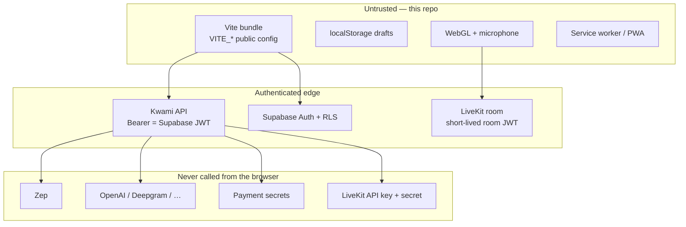

# Security

How this **client** is supposed to fail closed. Reporting process: [SECURITY.md](../SECURITY.md). Trust-boundary decisions: [ADR 0002](adr/0002-no-secrets-in-the-client.md).

The browser is an **untrusted** process. Anything in the Vue bundle, `localStorage`, or a `VITE_*` variable is visible to the user and to any XSS. Secrets and tenancy live on the Kwami API, LiveKit, Supabase RLS, and Zep.

## Assets this app may hold

| Allowed | Forbidden |
| --- | --- |
| `VITE_API_URL`, `VITE_LIVEKIT_URL` | Provider API keys |
| `VITE_SUPABASE_URL` + publishable / anon key | Supabase `service_role` |
| Short-lived Supabase access token (memory only) | Persisting access tokens in logs or fixtures |
| Short-lived LiveKit **room** JWT (memory only) | LiveKit API key / API secret |
| Workspace config JSON (soul, theme, drafts) | Zep API keys |
| | Stripe secret keys |

`VITE_*` is inlined at build time. Desktop (Tauri) and PWA builds bake the same values. Do not prefix a secret with `VITE_`.

Startup validation (`src/lib/env.ts`) fails the boot UI if `VITE_SUPABASE_URL` or `VITE_SUPABASE_PUBLISHABLE_KEY` is missing. `VITE_API_URL` defaults to `http://localhost:8080` for local dev.

## Trust boundaries

### 1. Auth (Supabase)

- Session restore goes through `supabase.auth.getSession()`.
- Google (and optional Apple / Azure / GitHub) OAuth can finish in a **popup**. The popup posts `{ type: 'supabase-auth-callback', session }` to `window.opener`. The parent **must** ignore messages from any other origin.
- Wallet providers (Phantom, MetaMask) are opt-in via `VITE_AUTH_PROVIDERS` and still produce a Supabase session — they are not a second auth stack. Phantom is resolved via `window.phantom.solana` rather than `window.solana`, which any installed Solana wallet may claim.
- Email + password goes straight to `signInWithPassword` / `signUp`; no credential is stored or logged client-side. A sign-up for an address that already has a confirmed account is reported as such, which trades Supabase's user-enumeration protection for not leaving the user waiting on a mail that never arrives — see the comment in `useEmailAuth.ts` to revert that choice.
- Hash fragments that contain `access_token` are stripped with `history.replaceState`.
- `getAuthToken()` de-duplicates session reads, refreshes ~60s before `expires_at`, and invalidates on `onAuthStateChange`.

### 2. Kwami API

Every backend call goes through [`src/lib/apiClient.ts`](../src/lib/apiClient.ts):

- `Authorization: Bearer <access_token>` unless `auth: false`
- One 401 replay after clearing the token cache
- Timeouts (15s default; longer for token mint / outbound calls)
- Retries only for GET/PUT (or any method with `Idempotency-Key`) on 408 / 425 / 429 / 502 / 503 / 504
- Money-moving or side-effecting routes set `retry: false`

`createRequestGuard()` aborts the previous request for a key so a companion switch cannot apply the previous graph, inbox, or wallet to the new one.

### 3. LiveKit token

`useKwami.fetchLiveKitToken()` posts to `POST {VITE_API_URL}/token` via `apiClient`. The SDK's own `fetchToken()` is unused because it flattened HTTP status into `statusText` and hid `402`.

The request body omits `roomName` so the server can pick an unguessable room. `kwamiId` is sent only for persisted workspace rows (the API 404s unknown ids).

A `402` becomes `ApiError.isInsufficientCredits` → `kwami:insufficient-credits`.

### 4. Memory

`memoryUserId = kwami_{supabaseUserId}_{workspaceId}`. The client never talks to Zep. Graph CRUD is `/memory/{memoryUserId}/*`. Deleting a companion best-effort deletes that graph.

### 5. Agent tools and XSS

The LiveKit agent can invoke **client tools** (open panels, change theme, draft mail). Treat tool arguments as untrusted:

- Do not `v-html` tool strings or search-result snippets
- Panel aliases are a fixed map (`PANEL_ALIASES`); unknown ids are ignored
- Web-search cards render title / URL / text as text nodes
- `BrowserPanel` is an iframe of a **backend-hosted** browser session; it is not a general-purpose webview for arbitrary attacker URLs from the agent without the API's allowlist

### 6. PWA / service worker

`vite-plugin-pwa` uses `registerType: 'autoUpdate'`. Workbox precaches the app shell. Runtime caching is limited to Google Fonts. Do not cache authenticated API responses in the service worker.

### 7. Desktop

Tauri embeds the same origin-less `VITE_*` build. `csp` in `tauri.conf.json` is currently `null` — set it before shipping a signed installer. See [Desktop](guides/desktop.md).

## Higher-severity review list

| Area | Why |
| --- | --- |
| OAuth popup origin check | Session theft if `postMessage` accepts `*` |
| Token cache + 401 replay | Stale Bearer after sign-out / user switch |
| `BrowserPanel` + extension messages | XSS / clickjacking into the split view |
| Agent tool arguments | Stored XSS if a panel interpolates HTML |
| Accidental `console.log` of JWTs or transcripts | Production builds drop `console`; tests and `vite dev` do not |
| `user_kwamis` / `user_app_settings` RLS | Not in this repo; a missing policy leaks every companion |

Out of scope for this repository: Zep tenancy, credit debit math, LiveKit room ACLs, Stripe webhooks. Report those to the API / infra owners.

## What to do as a contributor

1. New HTTP: `api` from `apiClient`, never raw `fetch` to the Kwami API
2. New env: only `VITE_*` public values; document them in [Environment variables](reference/environment-variables.md)
3. New panel that renders agent or search data: text interpolation only
4. Tests: no real access tokens in fixtures; Playwright uses `--mode test` and `.env.test`
5. If you find a vulnerability, email **security@kwami.io** — do not open a public issue
